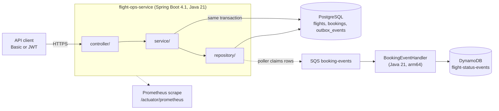
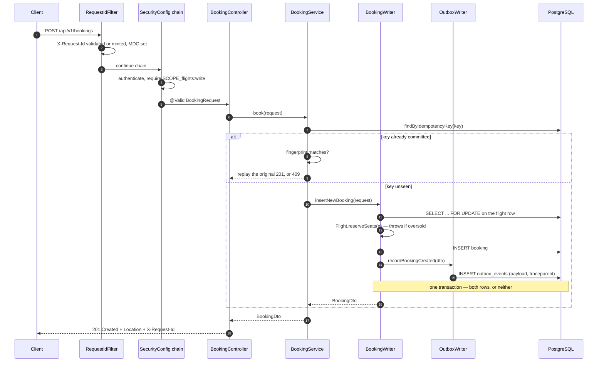
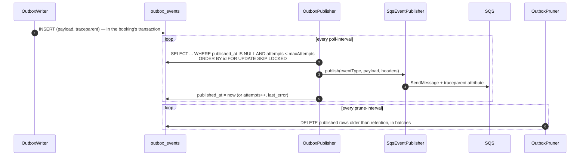
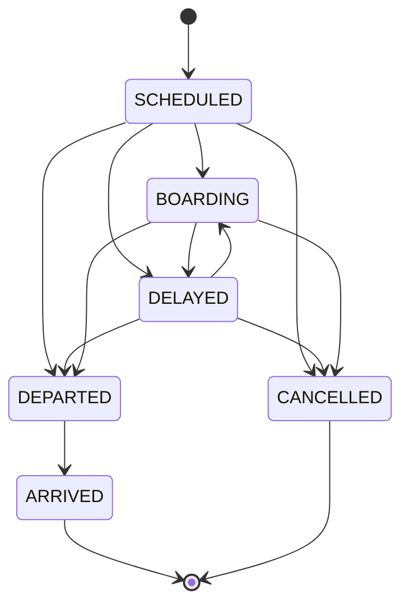
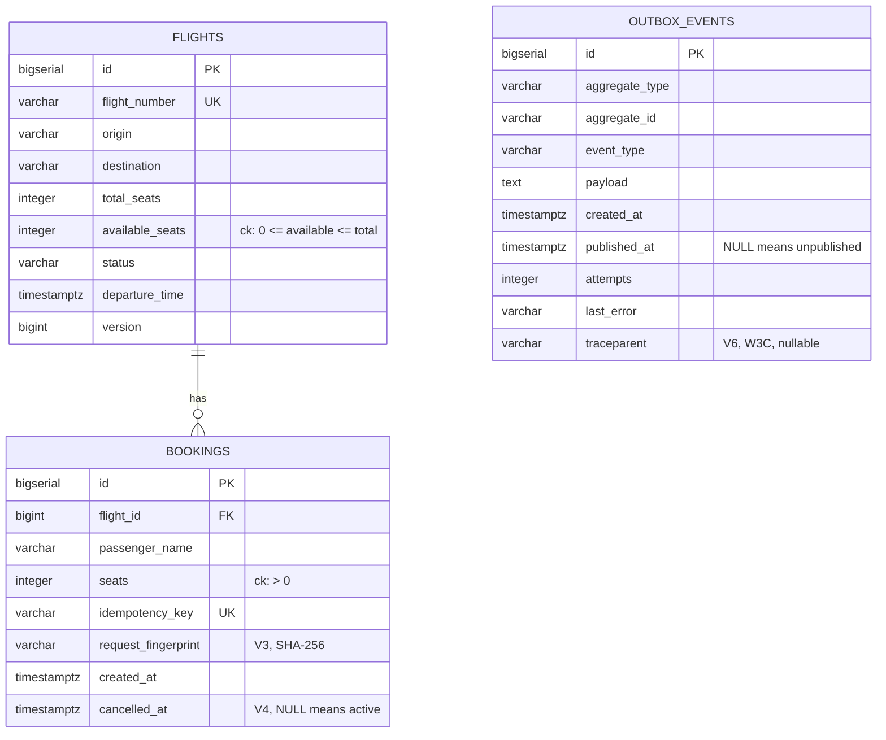
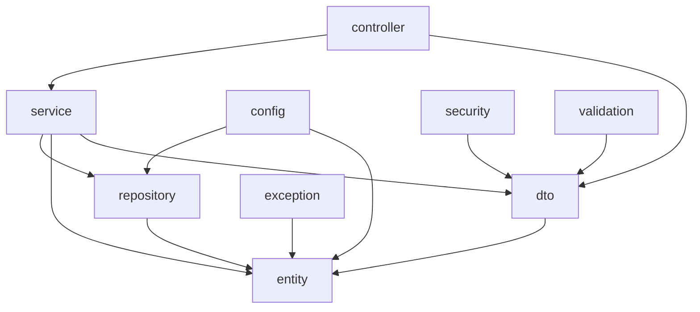
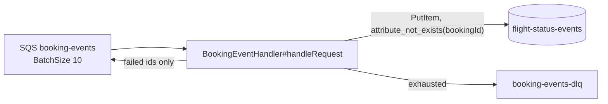

# Architecture

How the pieces fit, why they are arranged this way, and where in the source
each claim can be checked. Every path and symbol named here is verified by
`scripts/refcheck.py` on every CI run, so a rename breaks this document's
build rather than quietly making it a lie.

The decisions themselves — the ones with alternatives that were considered and
rejected — live in [`adr/`](adr/README.md), one file each. This document is
the map; the ADRs are the reasoning.

## Contents

- [The shape of it](#the-shape-of-it)
- [One booking, end to end](#one-booking-end-to-end)
- [Idempotency, as a decision table](#idempotency-as-a-decision-table)
- [Concurrency: what is locked, and in what order](#concurrency-what-is-locked-and-in-what-order)
- [The outbox](#the-outbox)
- [Flight status is a state machine](#flight-status-is-a-state-machine)
- [Data model](#data-model)
- [Module boundaries](#module-boundaries)
- [The consumer half](#the-consumer-half)
- [Where the seams are](#where-the-seams-are)

---

## The shape of it

Two processes and one queue. The service owns bookings and seat inventory and
answers HTTP synchronously; the Lambda owns a read-optimised projection of
booking events and never talks to the service at all.



The dotted line from the repository to SQS is the only asynchronous edge, and
it is deliberately the only one. Everything a caller is told in a response has
already committed to PostgreSQL; nothing a caller is told depends on SQS being
up. That property is what the outbox buys, and it is the single most important
structural decision in the service — see [ADR 0001](adr/0001-transactional-outbox.md).

**What is real and what is a stub.** The authorisation rules, the locking, the
idempotency, the migrations and the event contract are production shapes. The
user store is two in-memory accounts, and the deployment has never been run
against real AWS. The README's `Project status` table is the authoritative
list; nothing here contradicts it.

---

## One booking, end to end

`POST /api/v1/bookings` is the request worth reading, because every hard part
of this service is on its path: validation, idempotency, a row lock, an
invariant, an event, and a response that has to be safe to retry.



Reading it in the source, in order:

| Step | Where | What it is responsible for |
|---|---|---|
| Correlation | `src/main/java/com/smit/flightops/observability/RequestIdFilter.java#doFilterInternal` | Ahead of Spring Security, so a 401 also carries `X-Request-Id` |
| Authorisation | `src/main/java/com/smit/flightops/config/SecurityConfig.java#apiSecurityFilterChain` | One rule set for Basic and JWT alike |
| Binding and validation | `src/main/java/com/smit/flightops/dto/BookingRequest.java` | Bean Validation on the record components; failures become 400 before any service code runs |
| Idempotency | `src/main/java/com/smit/flightops/service/BookingService.java#book` | Decides replay, conflict or insert. Holds no transaction of its own — deliberately |
| The write | `src/main/java/com/smit/flightops/service/BookingWriter.java#insertNewBooking` | The transaction, the row lock, the seat arithmetic and the outbox row |
| The race loser | `src/main/java/com/smit/flightops/service/BookingWriter.java#recoverReplay` | `REQUIRES_NEW`, because the caller's transaction is already poisoned by the constraint violation |
| The event | `src/main/java/com/smit/flightops/service/OutboxWriter.java#recordBookingCreated` | `Propagation.MANDATORY` — it refuses to run outside the booking's transaction |
| The response | `src/main/java/com/smit/flightops/controller/BookingController.java#book` | 201 with a `Location` header, built from the id the database assigned |

Two details in that table are easy to miss and are the reason the path works:

- **`BookingService#book` is not transactional.** It cannot be. It catches
  `DataIntegrityViolationException` from the insert and then has to read the
  winner's row — and a transaction that has seen a constraint violation is
  already marked rollback-only, so the recovery read has to happen in a new
  one. That is `recoverReplay`, and its `REQUIRES_NEW` is the whole reason it
  is a separate method on a separate bean.
- **`OutboxWriter#recordBookingCreated` is `MANDATORY`.** Called outside a
  transaction it would still work — Spring Data would open one for the save,
  the row would appear, and the atomicity that justifies the entire outbox
  would be silently gone. `MANDATORY` turns that into an exception on the
  first call instead of a defect nobody notices.

---

## Idempotency, as a decision table

The client sends `idempotencyKey` in the body. What happens next depends on
two questions: has that key committed, and is this the same request.

| Key seen before | Same request? | Outcome | Status | Where |
|---|---|---|---|---|
| No | — | Insert, debit seats, write the event | `201` | `BookingWriter#insertNewBooking` |
| Yes, committed | Yes | Return the original booking, debit nothing | `201` | `BookingService#book` |
| Yes, committed | No | Refuse — the key means something else already | `409 IDEMPOTENCY_KEY_CONFLICT` | `BookingService#book` |
| Yes, in flight elsewhere | Yes | Lose the unique-index race, then read the winner | `201` | `BookingWriter#recoverReplay` |
| Yes, in flight elsewhere | No | Lose the race, then fail the fingerprint check | `409` | `BookingWriter#recoverReplay` |

"Same request" is a SHA-256 over the normalised request —
`src/main/java/com/smit/flightops/dto/BookingRequest.java#fingerprint` — stored
on the row as `request_fingerprint` (V3). Comparing the key alone is the bug
this table exists to prevent: a client that reuses one key for a different
passenger gets `201` and somebody else's booking back, with no seats debited
for the booking it believes it just made. The unique constraint cannot catch
that; it is doing exactly its job.

`BookingIdempotencyTest` drives the two in-flight rows with ten threads on one
key, twice.

---

## Concurrency: what is locked, and in what order

Seat inventory is a counter that two requests will try to decrement at the same
moment. The service takes a **pessimistic row lock** on the flight, not an
optimistic version check:

```java
@Lock(LockModeType.PESSIMISTIC_WRITE)                     // FlightRepository#findByFlightNumberForUpdate
@Query("SELECT f FROM Flight f WHERE f.flightNumber = :fn")
Optional<Flight> findByFlightNumberForUpdate(@Param("fn") String fn);
```

Optimistic locking is the better default for low contention, and seat sales are
the case it handles worst: the last few seats on a popular flight are exactly
where every request collides, and `@Version` turns each collision into a
retry storm at the moment the system is busiest. Pessimistic locking serialises
them instead. See [ADR 0002](adr/0002-pessimistic-locking.md).

Three properties keep that from becoming an outage:

- **A bounded wait.** `SET LOCAL lock_timeout` is applied per transaction
  (`src/main/java/com/smit/flightops/service/BookingWriter.java#insertNewBooking`),
  so a request that cannot get the lock fails in seconds with
  `503 LOCK_TIMEOUT` rather than holding a connection until the pool is empty.
  `LockTimeoutTest` proves the timeout and the status code.
- **One lock order everywhere.** Booking and cancellation both take the flight
  row first and the booking row second
  (`src/main/java/com/smit/flightops/service/BookingWriter.java#cancelBooking`).
  Two paths that disagree about that order deadlock under load and nowhere
  else, which is the worst possible place to find out.
- **The database has the final word.** `ck_flights_seat_floor` (V2) makes
  `available_seats >= 0` a constraint, not a convention. Application code that
  gets the arithmetic wrong fails the INSERT instead of overselling.

The outbox poller takes no flight locks at all. It claims outbox rows with
`FOR UPDATE SKIP LOCKED`
(`src/main/java/com/smit/flightops/repository/OutboxEventRepository.java#claimUnpublished`),
so N replicas drain disjoint batches with no leader election and no distributed
lock.

---

## The outbox

Three moving parts, deliberately separated: a writer inside the booking
transaction, a poller outside it, and a pruner that keeps the table from
growing forever.



Five decisions are worth naming, each with the failure it prevents:

1. **Publish, then mark.** A crash between the two republishes the event; the
   other order loses it. At-least-once is a choice, and the consumer's
   conditional write is what absorbs it.
2. **`attempts < maxAttempts` in the claim.** The claim is `ORDER BY id`, so a
   row the transport structurally rejects is retried *first* on every tick and
   starves live events behind it. The ceiling drops it out of the claim,
   `outbox.dead` rises, and a human redrives it with
   `UPDATE outbox_events SET attempts = 0 WHERE id = ?`.
3. **The trace is captured by the writer.** The poller runs minutes later on a
   scheduler thread with no relationship to the request, so a traceparent read
   there would be meaningless. It is injected at booking time
   (`src/main/java/com/smit/flightops/service/OutboxWriter.java#currentTraceparent`)
   and stored on the row (V6).
4. **`fixedDelay`, not `fixedRate`.** Under strain `fixedRate` queues scheduler
   invocations behind each other; `fixedDelay` simply slows the polling down.
5. **The pruner walks the primary key.** `ORDER BY id` with a `LIMIT` and a
   per-run ceiling means no index on `published_at` is needed — and that index
   would be a write on the booking transaction's hot path
   (`src/main/java/com/smit/flightops/repository/OutboxEventRepository.java#deletePublishedBefore`).

The transport itself is one interface,
`src/main/java/com/smit/flightops/service/EventPublisher.java`, with two
implementations: `LoggingEventPublisher` for local runs and `SqsEventPublisher`
in AWS. Swapping transports is a bean definition, not a rewrite, and no
business logic knows which one is wired.

---

## Flight status is a state machine

`PATCH /api/v1/flights/{n}/status` used to accept any status from any status,
which meant a cancelled flight could be moved back to `SCHEDULED` and start
selling seats again. The graph now lives in
`src/main/java/com/smit/flightops/entity/FlightStatus.java#canTransitionTo`:



Two judgement calls inside it: a status may always transition to itself, so a
client retrying `DELAYED` after a timeout gets `200` rather than `409`; and
`ARRIVED` and `CANCELLED` are terminal, because correcting a status recorded in
error is a data-repair job with an audit trail, not a PATCH.

Which statuses are bookable is a separate question, answered by
`src/main/java/com/smit/flightops/entity/FlightStatus.java#isBookable` with an
exhaustive switch and no `default` — so adding a constant is a compile error
rather than an inherited policy nobody chose.

---

## Data model

Three tables, six migrations. Flyway owns the PostgreSQL schema and
`ddl-auto: validate` checks the entity mapping against it, so a mapping that
drifts from the migrations fails at startup rather than at the first query.



| Migration | What it adds | Why it is its own migration |
|---|---|---|
| `V1__init.sql` | `flights`, `bookings` | — |
| `V2__seat_and_route_invariants.sql` | Seat and route CHECK constraints | The invariants the application enforces, restated where they cannot be bypassed |
| `V3__booking_request_fingerprint.sql` | `request_fingerprint` | Nullable on purpose: rows written before V3 have no fingerprint, and backfilling a hash of a request nobody kept is not possible |
| `V4__booking_cancellation.sql` | `cancelled_at` + a partial index on active bookings | Cancellation is a soft delete, so the row remains addressable and a repeated DELETE is safe |
| `V5__outbox.sql` | `outbox_events` + a partial index on unpublished rows | The poller's claim only ever reads unpublished rows, so the index only covers them |
| `V6__outbox_traceparent.sql` | `traceparent` | Diagnostics, nullable, and deliberately without an index |

`version` on `flights` is JPA's optimistic-locking column. It is kept even
though the write path locks pessimistically: it costs one integer and catches
any future path that updates a flight without taking the row lock first.

---

## Module boundaries

The package layout is not a convention here, it is a build gate.
`src/test/java/com/smit/flightops/ArchitectureTest.java` fails the build on a
violation, so the diagram below is executable:



| Rule | What it prevents |
|---|---|
| `layers_are_respected` | A repository reaching back into a service, or anything reaching into `controller` |
| `controllers_do_not_touch_entities` | A LAZY proxy serialised outside its transaction, and a new column silently becoming public API |
| `no_field_injection` | Untestable beans and a hidden required dependency |
| `no_java_util_logging`, `no_standard_streams` | Log lines that bypass the correlation pattern entirely |
| `repositories_are_interfaces` | Hand-written persistence sneaking in beside Spring Data |
| `transactions_are_opened_only_in_the_service_layer` | A transaction opened in a controller, spanning the HTTP response |
| `the_wall_clock_is_read_only_by_entities` | `Instant.now()` in testable code, where an injected `Clock` belongs |
| `no_web_types_below_the_controller` | A service that cannot be called from a scheduler or a test |

Each rule was checked against a deliberate violation before it was committed —
a rule that has never failed is a rule nobody has proved works.

---

## The consumer half

The Lambda is a separate Maven build with no dependency on the service, and
that is the point: a shared event jar would make the two deploy together, which
is the coupling the queue exists to remove.



- The contract between them is a file, `contracts/booking-created-v1.json`,
  asserted from both sides by two tests that never import each other's code.
- Partial batch failure: only the failed message ids are returned, so one
  poison message does not redeliver the nine beside it that succeeded.
- The sort key is `timestamp#bookingId`, fixed-width, because DynamoDB sorts
  range keys as bytes and `Instant.toString()` is not fixed width.
- The producer's `traceparent` arrives as a message attribute and is logged
  after being matched against the W3C shape —
  `lambda/src/main/java/com/smit/flightops/lambda/BookingEventHandler.java#tracePrefix`.

Everything about the deployment package — why three HTTP clients are excluded,
why `UrlConnectionHttpClient` — is in the README's Lambda section.

---

## Where the seams are

The places this design expects to be extended, and what each one costs:

| Seam | Swap in | Cost |
|---|---|---|
| `EventPublisher` | Kafka, Solace, EventBridge | One bean definition. The payload is already serialised; an implementation receives bytes it must not interpret |
| `spring.security.oauth2.resourceserver.jwt.issuer-uri` | Cognito, Okta, Entra | Configuration. The rules already treat a JWT scope and a Basic authority identically |
| `Clock` (`src/main/java/com/smit/flightops/config/TimeConfig.java`) | A fixed clock in a test | Already used everywhere except `Booking.createdAt`, which is the documented exception |
| `management.opentelemetry.tracing.export.otlp.endpoint` | An OTLP collector | An environment variable. Ids are already generated and already on every log line |
| The outbox poller | Debezium reading the WAL | A replication slot, a connector to operate, and a disk that fills if the consumer stops. Considered and rejected at this size |

---

*Written against the tree at the commit that introduced this file. Every path
and `path#symbol` in it is checked by `scripts/refcheck.py`; every heading link
by `scripts/linkcheck.py`.*
