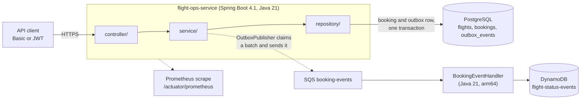
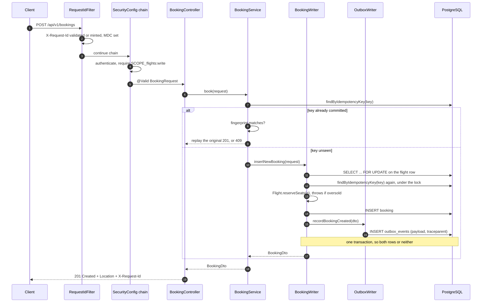
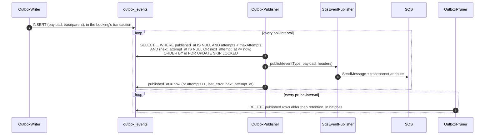
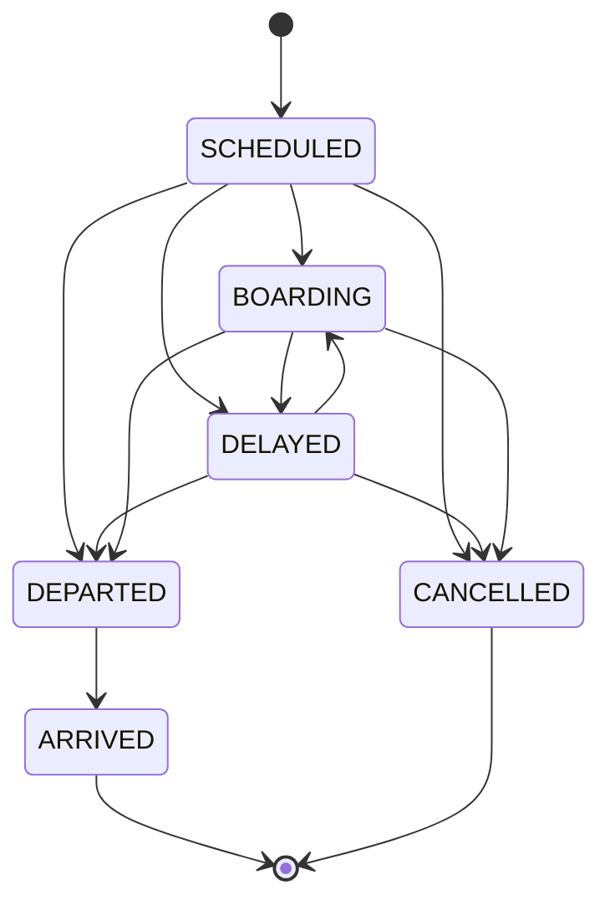
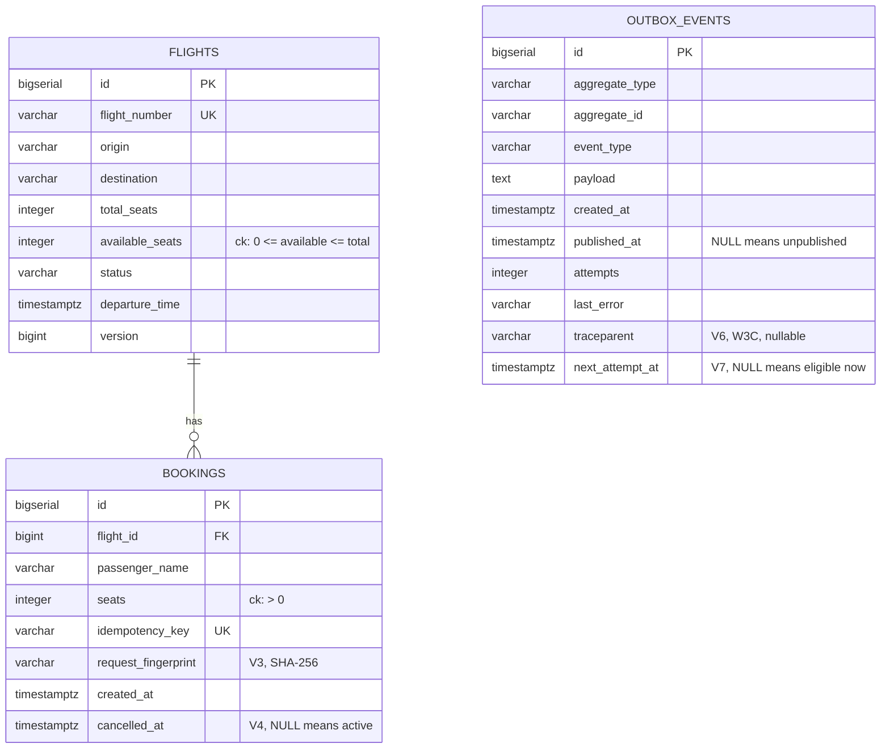
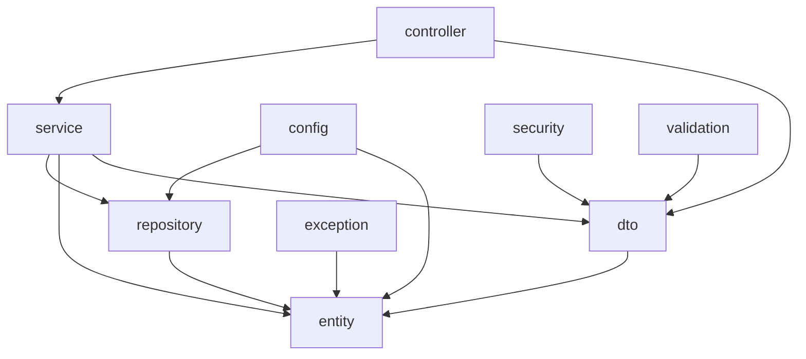
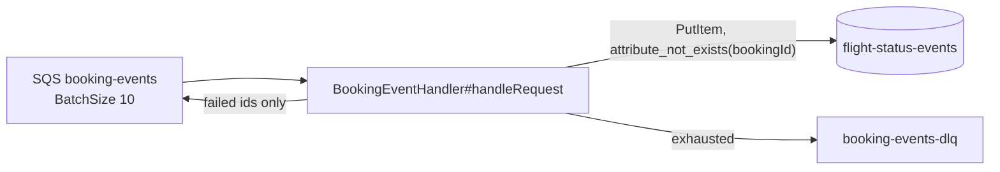

# Architecture

This document shows how the pieces fit, why they are arranged this way, and
where in the source each claim can be checked. On every CI run,
`scripts/refcheck.py` checks every path and `path#symbol` named here and
`scripts/linkcheck.py` checks every heading link. A rename that leaves this
document behind fails the build.

Each decision where I weighed alternatives has its own file in
[`adr/`](adr/README.md), with the options I rejected. This document is the map,
and the ADRs hold the reasoning.

## Contents

| Section | What it covers |
|---|---|
| [The shape of it](#the-shape-of-it) | Two processes, one queue |
| [One booking, end to end](#one-booking-end-to-end) | `POST /api/v1/bookings`, method by method |
| [Idempotency, as a decision table](#idempotency-as-a-decision-table) | Replay, reuse and races on one key |
| [Concurrency: what is locked, and in what order](#concurrency-what-is-locked-and-in-what-order) | The flight row lock and its timeout |
| [The outbox](#the-outbox) | Writer, poller and pruner |
| [Flight status is a state machine](#flight-status-is-a-state-machine) | Transitions and bookable statuses |
| [Data model](#data-model) | Tables, migrations, `version` |
| [Module boundaries](#module-boundaries) | The ArchUnit rules |
| [The consumer half](#the-consumer-half) | The Lambda and its deployment package |
| [Where the seams are](#where-the-seams-are) | Extension points and their cost |

---

## The shape of it

Two processes and one queue. The service owns bookings and seat inventory and
answers HTTP synchronously. The Lambda owns a read-optimised projection of
booking events and never talks to the service.



The dotted line to SQS starts at `service/`, because `OutboxPublisher` is a
scheduled component there. `repository/` has no dependency on any transport.
`layers_are_respected` fails the build if `repository/` ever reaches into
`service/`, where `EventPublisher` and both of its implementations live.

That dotted line is the only asynchronous edge, and I kept it that way.
Everything a caller is told in a response has already committed to PostgreSQL,
and no response depends on SQS being up. That property is what the outbox
buys. It is the most important structural decision in the service, and
[ADR 0001](adr/0001-transactional-outbox.md) explains it.

Some parts are stubs. The authorisation rules, the locking, the idempotency,
the migrations and the event contract are production shapes. The user store is
two in-memory accounts, and the deployment has never been run against real
AWS. The README's `Project status` table is the authoritative list.

---

## One booking, end to end

`POST /api/v1/bookings` is the request to read first. Every hard part of this
service is on its path: validation, idempotency, a row lock, an invariant, an
event, and a response that has to be safe to retry.



Reading it in the source, in order:

| Step | Where | What it is responsible for |
|---|---|---|
| Correlation | `src/main/java/com/smit/flightops/observability/RequestIdFilter.java#doFilterInternal` | Runs ahead of Spring Security, so a 401 also carries `X-Request-Id` |
| Authorisation | `src/main/java/com/smit/flightops/config/SecurityConfig.java#apiSecurityFilterChain` | One rule set for Basic and JWT alike |
| Binding and validation | `src/main/java/com/smit/flightops/dto/BookingRequest.java` | Bean Validation on the record components. Failures become 400 before any service code runs |
| Idempotency | `src/main/java/com/smit/flightops/service/BookingService.java#book` | Decides replay, conflict or insert. Holds no transaction of its own |
| The write | `src/main/java/com/smit/flightops/service/BookingWriter.java#insertNewBooking` | The transaction, the row lock, the key re-check under the lock, the seat arithmetic and the outbox row |
| The race loser | `src/main/java/com/smit/flightops/service/BookingWriter.java#recoverReplay` | Reads the winner in a fresh read-only transaction. `BookingService#book` holds no transaction, so the loser's has already rolled back. If `book` ever becomes transactional, `REQUIRES_NEW` still keeps the read in its own transaction |
| The event | `src/main/java/com/smit/flightops/service/OutboxWriter.java#recordBookingCreated` | `Propagation.MANDATORY`: it refuses to run outside the booking's transaction |
| The response | `src/main/java/com/smit/flightops/controller/BookingController.java#book` | 201 with a `Location` header, built from the id the database assigned |

The path depends on details in that table that are easy to miss:

- **`BookingService#book` is not transactional.** It cannot be. The race is
  lost in one of two ways. Usually `insertNewBooking`, holding the flight row
  lock, finds the key already present and throws
  `LostIdempotencyRaceException`. When the same key is sent for a different
  flight, the two requests lock different rows. Then
  `uk_bookings_idempotency_key` throws `DataIntegrityViolationException`
  instead. Either way, the loser's transaction has rolled back by the time
  `book` catches the exception, and `recoverReplay` reads the winner in a
  transaction of its own. If `book` ever becomes transactional again, a
  recovery read without `REQUIRES_NEW` would join the loser's transaction.
  After a constraint violation, PostgreSQL has already marked that transaction
  aborted. That is how the race loser used to get a 409. `REQUIRES_NEW` keeps
  the read out of that transaction.

- **`OutboxWriter#recordBookingCreated` is `MANDATORY`.** Called outside a
  transaction, it would still appear to work. Spring Data would open a
  transaction for the save and the row would appear. The atomicity that
  justifies the whole outbox would be gone, with no error to say so.
  `MANDATORY` turns that mistake into an exception on the first call.

---

## Idempotency, as a decision table

The client sends `idempotencyKey` in the body. What happens next depends on
two questions: has that key committed, and is this the same request?

| Key seen before | Same request? | Outcome | Status | Where |
|---|---|---|---|---|
| No | n/a | Insert, debit seats, write the event | `201` | `BookingWriter#insertNewBooking` |
| Yes, committed | Yes | Return the original booking, debit nothing | `201` | `BookingService#book` |
| Yes, committed | No | Refuse, because the key already means something else | `409 IDEMPOTENCY_KEY_REUSED` | `BookingService#book` |
| Yes, in flight elsewhere | Yes | Wait on the flight row lock, find the key on the re-read, then read the winner | `201` | `BookingWriter#insertNewBooking`, `BookingWriter#recoverReplay` |
| Yes, in flight elsewhere | No | Lose the race (the re-read under the lock, or the unique index when the other request is for a different flight), then fail the fingerprint check | `409 IDEMPOTENCY_KEY_REUSED` | `BookingWriter#recoverReplay` |

"Same request" is a SHA-256 over the normalised request
(`src/main/java/com/smit/flightops/dto/BookingRequest.java#fingerprint`),
stored on the row as `request_fingerprint` (V3). Comparing the key alone is the
bug this table exists to prevent. With a key-only check, a client that reuses
one key for a different passenger gets `201` and someone else's booking back.
No seats are debited for the booking it believes it just made. The unique
constraint cannot catch that, because it is doing its job: one booking per key.

`BookingIdempotencyTest` runs three 10-thread races, each on a single key: the
same request, different payloads, and the last seat.

---

## Concurrency: what is locked, and in what order

Seat inventory is a counter that two requests will try to decrement at the same
moment. I chose a pessimistic row lock on the flight over an optimistic version
check:

```java
@Lock(LockModeType.PESSIMISTIC_WRITE)                     // FlightRepository#findByFlightNumberForUpdate
@Query("SELECT f FROM Flight f WHERE f.flightNumber = :fn")
Optional<Flight> findByFlightNumberForUpdate(@Param("fn") String fn);
```

Optimistic locking is the better default when contention is low, and seat sales
are the case it handles worst. The last few seats on a popular flight are where
every request collides. There, `@Version` turns each collision into a retry
storm at the moment the system is busiest. Pessimistic locking serialises those
requests instead. See [ADR 0002](adr/0002-pessimistic-locking.md).

What keeps the lock from becoming an outage:

- **A bounded wait.** `SET lock_timeout = '3s'` runs once per connection as a
  session setting, through HikariCP's `connection-init-sql` in the `postgres`
  and `prod` profiles of `src/main/resources/application.yml`. No Java code
  issues it, so every lock the service takes gets the same bound, native SQL
  included. No query can forget a hint.
  [ADR 0002](adr/0002-pessimistic-locking.md) explains why I did not use a
  per-query hint. A request that cannot get the lock fails within seconds with
  `503 LOCK_TIMEOUT`. Without the bound it would hold a connection until the
  pool was empty. `LockTimeoutTest` proves the timeout and the status code. H2
  gets the same bound, spelled `SET LOCK_TIMEOUT 3000`.

- **One lock order everywhere.** Booking and cancellation both take the flight
  row first and the booking row second
  (`src/main/java/com/smit/flightops/service/BookingWriter.java#cancelBooking`).
  Two paths that disagree about that order deadlock only under load, which is
  the worst place to find out.

- **A floor in the schema.** `ck_flights_seat_floor` (V2) makes
  `available_seats >= 0` a database constraint. Application code that gets the
  arithmetic wrong fails the write instead of overselling.

The outbox poller takes no flight locks. It claims outbox rows with
`FOR UPDATE SKIP LOCKED`
(`src/main/java/com/smit/flightops/repository/OutboxEventRepository.java#claimUnpublished`),
so N replicas drain disjoint batches with no leader election and no distributed
lock.

---

## The outbox

The outbox is split into a writer inside the booking transaction, a poller
outside it, and a pruner that stops the table growing forever.



Each of these choices prevents a specific failure:

1. **Publish, then mark.** A crash between the two republishes the event, and
   marking first would lose it. I chose at-least-once delivery, and the
   consumer's conditional write absorbs the duplicates.

2. **A ceiling in the claim.** The claim is `ORDER BY id`, so a row the
   transport structurally rejects is retried first on every tick. It starves
   the live events behind it. `attempts < maxAttempts` drops it out of the
   claim and `outbox.dead` rises. An operator then re-drives it with
   `UPDATE outbox_events SET attempts = 0, next_attempt_at = NULL WHERE id = ?`.

3. **The writer captures the trace.** The poller runs later, sometimes minutes
   later, on a scheduler thread with no link to the request. A traceparent read
   there would be meaningless. The writer injects it at booking time
   (`src/main/java/com/smit/flightops/service/OutboxWriter.java#currentTraceparent`)
   and stores it on the row (V6).

4. **`fixedDelay`, not `fixedRate`.** Under strain, `fixedRate` queues
   scheduler invocations behind each other. `fixedDelay` slows the polling
   down instead.

5. **Pruning by primary key.** `ORDER BY id` with a `LIMIT` and a
   per-run ceiling means no index on `published_at` is needed. That index would
   add a write to the booking transaction's hot path
   (`src/main/java/com/smit/flightops/repository/OutboxEventRepository.java#deletePublishedBefore`).

The transport itself is one interface,
`src/main/java/com/smit/flightops/service/EventPublisher.java`, with two
implementations: `LoggingEventPublisher` for local runs and
`SqsEventPublisher` in AWS. Swapping transports takes one bean definition, and
no business logic knows which one is wired.

---

## Flight status is a state machine

`PATCH /api/v1/flights/{n}/status` used to accept any status from any status.
A cancelled flight could be moved back to `SCHEDULED` and start selling seats
again. The graph now lives in
`src/main/java/com/smit/flightops/entity/FlightStatus.java#canTransitionTo`:



I let a status always transition to itself, so a client retrying `DELAYED`
after a timeout gets `200` rather than `409`. I made `ARRIVED` and `CANCELLED`
terminal. Correcting a status recorded in error is a data-repair job with an
audit trail, and the PATCH endpoint is the wrong tool for it.

Which statuses are bookable is a separate question.
`src/main/java/com/smit/flightops/entity/FlightStatus.java#isBookable` answers
it with an exhaustive switch and no `default`. Adding a constant is then a
compile error until someone decides whether the new status accepts bookings.

---

## Data model

The schema is three tables and eight migrations. Flyway owns the PostgreSQL
schema, and `ddl-auto: validate` checks the entity mapping against it. A
mapping that drifts from the migrations fails at startup instead of at the
first query.



| Migration | What it adds | Why it is its own migration |
|---|---|---|
| `V1__init.sql` | `flights`, `bookings` | The initial schema |
| `V2__seat_and_route_invariants.sql` | Seat and route CHECK constraints | The invariants the application enforces, restated where they cannot be bypassed |
| `V3__booking_request_fingerprint.sql` | `request_fingerprint` | Nullable, because rows written before V3 have no fingerprint. A hash of a request no one kept cannot be backfilled |
| `V4__booking_cancellation.sql` | `cancelled_at`, and a partial index on active bookings that V8 removes | Cancellation is a soft delete, so the row stays addressable and a repeated DELETE is safe |
| `V5__outbox.sql` | `outbox_events` + a partial index on unpublished rows | The poller's claim only ever reads unpublished rows, so the index only covers them |
| `V6__outbox_traceparent.sql` | `traceparent` | Diagnostics only: nullable, and with no index |
| `V7__outbox_next_attempt_at.sql` | `next_attempt_at` | A failed send waits before it is retried. Without it, the ten-attempt ceiling was used up in ten seconds at a one-second poll |
| `V8__drop_unused_active_booking_index.sql` | Drops `idx_bookings_active` | The planner only uses a partial index when the query repeats its predicate, and no query here filters on `cancelled_at`. It was write cost with no reader |

`version` on `flights` is JPA's optimistic-locking column, and it does real
work today. `BookingWriter#insertNewBooking` and `BookingWriter#cancelBooking`
take the row lock.
`src/main/java/com/smit/flightops/service/FlightService.java#updateStatus` and
`src/main/java/com/smit/flightops/service/FlightService.java#cancel` load the
flight without it. A status change that races a booking on the same flight is
caught at flush by `version` and answered with `409 CONCURRENT_MODIFICATION`.
Without `version`, the stale UPDATE would write back the old `available_seats`
and restore the seats the booking had just debited.

---

## Module boundaries

The build enforces the package layout.
`src/test/java/com/smit/flightops/ArchitectureTest.java` fails it on any
violation, so the diagram below is executable:



| Rule | What it prevents |
|---|---|
| `layers_are_respected` | A repository reaching back into a service, or anything reaching into `controller` |
| `controllers_do_not_touch_entities` | A LAZY proxy serialised outside its transaction, and a new column becoming public API without anyone deciding it should |
| `no_field_injection` | Untestable beans and a hidden required dependency |
| `no_java_util_logging`, `no_standard_streams` | Log lines that bypass the correlation pattern |
| `repositories_are_interfaces` | Hand-written persistence sneaking in beside Spring Data |
| `transactions_are_opened_only_in_the_service_layer` | A transaction opened in a controller, spanning the HTTP response |
| `the_wall_clock_is_read_only_by_entities` | `Instant.now()` in testable code, where an injected `Clock` belongs |
| `no_web_types_below_the_controller` | A service that cannot be called from a scheduler or a test |

I checked each rule against a planted violation before committing it. A rule
that has never failed has not been shown to work.

---

## The consumer half

The Lambda is a separate Maven build with no dependency on the service. A
shared event jar would make the two deploy together, and the queue exists to
remove that coupling.



- The contract between them is a file, `contracts/booking-created-v1.json`.
  A test on each side asserts against it, and neither test imports the other
  side's code.

- Partial batch failure: the handler returns only the failed message ids. One
  poison message does not redeliver the nine beside it that succeeded.

- The sort key is `timestamp#bookingId`, with a fixed-width timestamp.
  DynamoDB sorts range keys as bytes, and `Instant.toString()` is not fixed
  width.

- The producer's `traceparent` arrives as a message attribute. The handler
  matches it against the W3C shape before logging it
  (`lambda/src/main/java/com/smit/flightops/lambda/BookingEventHandler.java#tracePrefix`).

- The deployment package carries one HTTP client.
  `software.amazon.awssdk:dynamodb` pulls in `apache-client`, `apache5-client`
  and `netty-nio-client` transitively. `lambda/pom.xml` excludes all three and
  adds `url-connection-client` (34 KB, no transitive dependencies), the client
  AWS documents for Lambda. The jar went from about 18 MB to 10.3 MB. With one
  sync provider on the classpath, and the client holder naming
  `UrlConnectionHttpClient`, the choice does not depend on classpath order. The
  cost is no HTTP/2, no tunable pool and synchronous calls only, which suits one
  `PutItem` per message.

---

## Where the seams are

These are the places I expect the design to be extended, and what each one
costs:

| Seam | Swap in | Cost |
|---|---|---|
| `EventPublisher` | Kafka, Solace, EventBridge | One bean definition. The payload is already serialised, and an implementation receives bytes it must not interpret |
| `spring.security.oauth2.resourceserver.jwt.issuer-uri` | Cognito, Okta, Entra | Configuration. The rules already treat a JWT scope and a Basic authority identically |
| `Clock` (`src/main/java/com/smit/flightops/config/TimeConfig.java`) | A fixed clock in a test | Already used everywhere except `Booking.createdAt`, which is the documented exception |
| `management.opentelemetry.tracing.export.otlp.endpoint` | An OTLP collector | An environment variable. Ids are already generated and already on every log line |
| The outbox poller | Debezium reading the WAL | A replication slot, a connector to operate, and a disk that fills if the consumer stops. I considered it and rejected it at this size |
