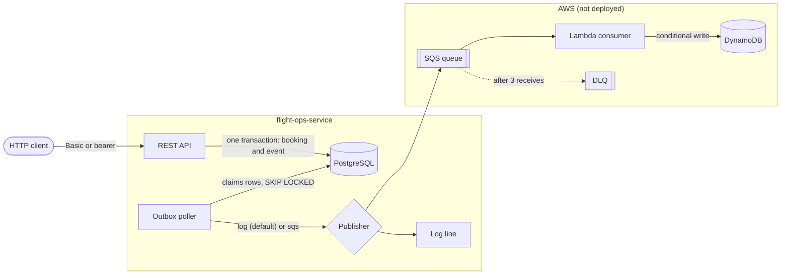

# flight-ops-service

[](https://github.com/smit-lakhani-13/flight-ops-services/actions/workflows/build-and-deploy.yml)
[](https://github.com/smit-lakhani-13/flight-ops-services/actions/workflows/codeql.yml)
[](LICENSE)

Seat inventory and bookings that stay correct under retries and contention: a Spring Boot 4 REST API over PostgreSQL, with an outbox that publishes to a log by default or to SQS, and a Lambda that projects events into DynamoDB.

I chose flight bookings because seat inventory is a real consistency problem: many clients want the same few seats, clients retry, and one mistake sells a seat twice.

**Built and tested:** Java 21, Spring Boot 4.1, Spring Security 7, JPA/Hibernate, Flyway, PostgreSQL 17, Testcontainers, Docker, GitHub Actions.

**Written and unit-tested or linted, never deployed:** SQS, Lambda, DynamoDB, Kubernetes, SAM. This is a demo service that has never been deployed or served production traffic; [Status](#status) says exactly what has run.



## What is hard here

- **No seat is sold twice.** Every path that changes seats or bookings locks the flight row with `SELECT … FOR UPDATE` first ([`src/main/java/com/smit/flightops/service/BookingWriter.java#insertNewBooking`](src/main/java/com/smit/flightops/service/BookingWriter.java)), and the wait is capped at 3 s so a busy row answers `503 LOCK_TIMEOUT` with `Retry-After` instead of holding a thread.
- **A retry never books twice, and a different request on the same key is refused.** A booking carries a client key and a fingerprint of the request ([`src/main/java/com/smit/flightops/dto/BookingRequest.java#fingerprint`](src/main/java/com/smit/flightops/dto/BookingRequest.java)). The same key with the same request returns the original booking; the same key with a different request is `409 IDEMPOTENCY_KEY_REUSED`; racing callers on one key all get one booking ([`src/main/java/com/smit/flightops/service/BookingService.java#book`](src/main/java/com/smit/flightops/service/BookingService.java)).
- **No booking without its event and no event without its booking:** one transaction writes both; delivery is at-least-once, and a row that exhausts its retries stays in the table, counted by `outbox.dead`. [`OutboxTest.java#aRolledBackBookingLeavesNoEvent`](src/test/java/com/smit/flightops/OutboxTest.java) and [`OutboxTest.java#aCommittedBookingLeavesOneEvent`](src/test/java/com/smit/flightops/OutboxTest.java) pin both halves.
- **More than one poller can run.** The poller claims rows with `FOR UPDATE SKIP LOCKED` ([`src/main/java/com/smit/flightops/repository/OutboxEventRepository.java#claimUnpublished`](src/main/java/com/smit/flightops/repository/OutboxEventRepository.java)), so two replicas take disjoint batches instead of queueing behind each other.
- **The consumer tolerates redelivery.** The Lambda writes with `attribute_not_exists(bookingId)`, so a duplicate message is a no-op, and a partial batch response reports only the messages that failed, so SQS redelivers just those ([`lambda/src/main/java/com/smit/flightops/lambda/BookingEventHandler.java#handleRequest`](lambda/src/main/java/com/smit/flightops/lambda/BookingEventHandler.java)).

## Status

| What | State |
|---|---|
| The service | Built and tested: 279 tests, 9 of them on PostgreSQL 17 and 1 on ElasticMQ through Testcontainers, which run in CI and skip on a machine without Docker. Every endpoint exercised over HTTP against a running instance; `scripts/demo.sh` replays the tour. |
| The SQS publisher and the Lambda | Unit-tested against mocked AWS SDK clients, and run in CI against emulators in containers: the publisher sends to ElasticMQ, where the test reads the message back, and the handler writes to DynamoDB Local on a table keyed as `lambda/template.yaml` keys it (the Lambda module has 28 tests, 3 of them on DynamoDB Local). Never connected to SQS or DynamoDB in AWS. |
| The container image | Built from the `Dockerfile`, started without a database and scanned by Trivy in CI on every push or pull request to `main`. Never pushed to a registry. The job logs the image size on every run, about 300 MB. |
| Written and linted, never run against AWS or a cluster | `deploy/k8s/` (kustomize), `lambda/template.yaml` (SAM), the scripts in `deploy/aws/` (CI renders the manifests with `render-aws.sh` and tests the teardown and `up.sh`'s checks against stubbed tools), and the deploy job, which is gated by a `DEPLOY_ENABLED` variable that has never been set. |
| Not implemented | A JMS publisher, trace export to a collector, rate limiting. |

Merging to `main` deploys nothing. Read the green badge as "it builds and the tests pass".

## Where to look

| Concern | Code | The test that proves it |
|---|---|---|
| Seats under contention | [`service/BookingWriter.java#insertNewBooking`](src/main/java/com/smit/flightops/service/BookingWriter.java), [`repository/FlightRepository.java#findByFlightNumberForUpdate`](src/main/java/com/smit/flightops/repository/FlightRepository.java) | [`BookingIntegrationTest.java#concurrentBookingsCannotOversell`](src/test/java/com/smit/flightops/BookingIntegrationTest.java) (20 threads, 5 seats, PostgreSQL) |
| Idempotent retries | [`service/BookingService.java#book`](src/main/java/com/smit/flightops/service/BookingService.java), [`entity/Booking.java#matchesRequest`](src/main/java/com/smit/flightops/entity/Booking.java) | [`BookingIntegrationTest.java#concurrentReplaysOfOneKeyBookOnce`](src/test/java/com/smit/flightops/BookingIntegrationTest.java) on PostgreSQL; for a fast local run on H2, [`BookingIdempotencyTest.java#racingTenCallersOnTheSameKeyAllGetTheSameBooking`](src/test/java/com/smit/flightops/BookingIdempotencyTest.java) and [`BookingIdempotencyTest.java#oneKeyRacedAcrossTwoFlightsBooksOnce`](src/test/java/com/smit/flightops/BookingIdempotencyTest.java) |
| The outbox | [`service/OutboxWriter.java#recordBookingCreated`](src/main/java/com/smit/flightops/service/OutboxWriter.java), [`service/OutboxPublisher.java#drainOutbox`](src/main/java/com/smit/flightops/service/OutboxPublisher.java) | [`OutboxTest.java#aRolledBackBookingLeavesNoEvent`](src/test/java/com/smit/flightops/OutboxTest.java), [`OutboxPoisonRowTest.java#anExhaustedRowDropsOutOfTheClaim`](src/test/java/com/smit/flightops/OutboxPoisonRowTest.java), [`OutboxPrunePostgresTest.java#concurrentClaimsAreDisjointAndSkipRowsNotYetDue`](src/test/java/com/smit/flightops/service/OutboxPrunePostgresTest.java) |
| Lock timeout to 503 | [`exception/GlobalExceptionHandler.java#handleLockTimeout`](src/main/java/com/smit/flightops/exception/GlobalExceptionHandler.java) | [`LockTimeoutPostgresTest.java#postgresLockTimeoutGives503`](src/test/java/com/smit/flightops/LockTimeoutPostgresTest.java) (PostgreSQL's own `lock_timeout`, SQLSTATE `55P03`); on H2, [`LockTimeoutTest.java#contendedFlightRowGives503`](src/test/java/com/smit/flightops/LockTimeoutTest.java) |
| Who may call what | [`config/SecurityConfig.java#apiSecurityFilterChain`](src/main/java/com/smit/flightops/config/SecurityConfig.java) | [`SecurityRulesTest.java#unmappedPathsAreDeniedByDefault`](src/test/java/com/smit/flightops/SecurityRulesTest.java), [`BearerTokenChallengeTest.java#aSignedTokensScopeMapsOntoTheRules`](src/test/java/com/smit/flightops/BearerTokenChallengeTest.java) |
| Layering | the package structure under `src/main/java/com/smit/flightops/` | [`ArchitectureTest.java#layers_are_respected`](src/test/java/com/smit/flightops/ArchitectureTest.java), [`ArchitectureTest.java#transactions_are_opened_only_in_the_service_layer`](src/test/java/com/smit/flightops/ArchitectureTest.java) |
| The consumer | [`BookingEventHandler.java#handleRequest`](lambda/src/main/java/com/smit/flightops/lambda/BookingEventHandler.java) | [`BookingEventHandlerTest.java#duplicateIsNotAFailure`](lambda/src/test/java/com/smit/flightops/lambda/BookingEventHandlerTest.java), [`BookingEventHandlerTest.java#reportsOnlyTheFailingMessage`](lambda/src/test/java/com/smit/flightops/lambda/BookingEventHandlerTest.java) |

## Quality gates

Every job below runs on every push or pull request to `main`, except `dependency-review`, which runs on pull requests only.

| Job | What fails it |
|---|---|
| `build` | A failing test in either module, including the PostgreSQL and emulator tests, which must run and not skip; line coverage under 80% or branch coverage under 50% (floors set well below the measured figures, to catch a collapse: [ADR 0014](adr/0014-quality-gates.md)); an ArchUnit rule; the enforcer (JDK 21, Maven 3.9, no dependency resolved below what another needs) |
| `infra-lint` | The kustomize render against the Kubernetes schemas, `cfn-lint`, `sam validate`, `shellcheck`, and a self-test of the deploy scripts against stubbed tools |
| `trivy-fs` | A CRITICAL or HIGH vulnerability with a fix available, or a committed secret that Trivy rates CRITICAL or HIGH |
| `image` | The image does not build, does not refuse to start without a database, or has a CRITICAL vulnerability with a fix available |
| `docs-check` | A cited file that does not exist or does not name the cited symbol; a broken relative link or heading anchor; this README's decision-record count or the index in `adr/README.md` disagreeing with `adr/`; a hygiene sweep of the tracked files and the commit messages |
| `dependency-review` | A pull request that adds a dependency with a high-severity advisory |

CodeQL runs the `security-extended` queries on every push or pull request to `main`, and weekly. [CONTRIBUTING.md](CONTRIBUTING.md#what-ci-enforces) lists every step.

## Design decisions

| Record | Decision |
|---|---|
| [0001](adr/0001-transactional-outbox.md) | A transactional outbox, not a send after commit: the event row commits with the booking, and the writer refuses to run outside a transaction. |
| [0002](adr/0002-pessimistic-locking.md) | Pessimistic row locks for seat inventory, with the wait bounded at 3 s on every connection. |
| [0004](adr/0004-request-fingerprint.md) | Idempotency is the key and a fingerprint of the request, so a reused key on a different request is a 409 and not someone else's booking. |
| [0006](adr/0006-stateless-sessions-no-csrf.md) | Stateless, CSRF off: no session cookie; every POST and PATCH takes only JSON, a DELETE needs a CORS preflight, and there is no CORS policy, so a cross-site page cannot send a write with a browser's cached Basic credentials. |
| [0008](adr/0008-standalone-lambda-consumer.md) | A plain `RequestHandler` on arm64 with no framework; a conditional `PutItem` makes a redelivered message a no-op. |
| [0014](adr/0014-quality-gates.md) | The build fails on architecture, coverage and dependency drift. |
| [0015](adr/0015-event-transport.md) | Events go to an SQS standard queue, not a JMS broker; what a broker such as Solace would change is taken from its documentation, never built or run. |

All 16 decision records: [adr/README.md](adr/README.md).

## Run it

A JDK 21, git and curl. `scripts/demo.sh` also needs `python3`, and pretty-prints with `jq` when it is installed. No database, Docker or AWS account.

```bash
git clone https://github.com/smit-lakhani-13/flight-ops-services.git && cd flight-ops-services
java -version                     # must report 21
./mvnw spring-boot:run            # in-memory H2, three seeded flights
```

In a second terminal:

```bash
curl -u api:dev-secret localhost:8080/api/v1/flights/UA123
scripts/demo.sh                   # the tour over HTTP; --fast skips the pauses
```

Swagger UI is at <http://localhost:8080/swagger-ui.html>. The two accounts, `api` / `dev-secret` and `ops` / `dev-ops`, are the defaults in every profile except `prod`, which has none, and `compose.yaml` sets bcrypt hashes of the same two passwords; [doc/api.md](doc/api.md#authentication) explains them and what the `prod` profile checks at startup. On macOS, see [CONTRIBUTING.md](CONTRIBUTING.md#use-jdk-21) if `java -version` does not say 21.

`docker compose up --build` is meant to run the same service on PostgreSQL 17. `compose.yaml` is written and has not been run end to end.

## API

| Method | Path | Requires | Success |
|---|---|---|---|
| `GET` | `/api/v1/flights/{flightNumber}` | `flights:read` | 200 |
| `GET` | `/api/v1/flights?origin=&destination=&page=&size=&sort=` | `flights:read` | 200, paged |
| `POST` | `/api/v1/flights` | `flights:write` | 201 and `Location` |
| `PATCH` | `/api/v1/flights/{flightNumber}/status` | `flights:write` | 200 |
| `DELETE` | `/api/v1/flights/{flightNumber}` | `flights:write` | 204 |
| `POST` | `/api/v1/bookings` | `flights:write` | 201 and `Location` |
| `GET` | `/api/v1/bookings/{bookingId}` | `flights:read` | 200 |
| `GET` | `/api/v1/bookings?flightNumber=&page=&size=&sort=` | `flights:read` | 200, paged |
| `DELETE` | `/api/v1/bookings/{bookingId}` | `flights:write` | 200 |
| `GET` | `/actuator/health`, `/actuator/health/liveness`, `/actuator/health/readiness` | nothing | 200, or 503 while `DOWN` or `OUT_OF_SERVICE` |

The other actuator endpoints need the `ops` account. `/v3/api-docs` and Swagger UI are public, and every operation they list still needs credentials ([ADR 0012](adr/0012-openapi-public-read.md)). Every response the application's error handlers write has one of two JSON shapes, `{code, message, timestamp}` or `{code, fieldErrors, timestamp}`; [doc/api.md](doc/api.md) has the failures per operation, the error codes, the request rules and worked examples.

## Found in self-review

Four entries from the defect log are below. I reproduced most of the log's defects against a running instance before fixing them, and each entry in the log gives the symptom, the cause, the test that pins the fix where one exists, and the commit.

- [Seats sold on a cancelled flight](doc/DEFECT-LOG.md#seats-sold-on-a-cancelled-flight): `Flight.reserveSeats` checked the seat count and ignored the status, and every test passed.
- [One idempotency key, two answers](doc/DEFECT-LOG.md#one-idempotency-key-two-answers): ten racing replays of one booking got a mix of 201 and 409.
- [The outbox and a slow queue](doc/DEFECT-LOG.md#the-outbox-and-a-slow-queue): an SQS call with no timeout ran inside the booking transaction, and the fix grew into an outbox.
- [A teardown that could pass on an error](doc/DEFECT-LOG.md#a-teardown-that-could-pass-on-an-error): found by reading `deploy/aws/down.sh`, since there is no AWS account to run it against; an expired token would have made every check print PASS.

More, including four review passes over my own code, are in [the defect log](doc/DEFECT-LOG.md), and [CHANGELOG.md](CHANGELOG.md) records what changed in each release.

## Trade-offs and still open

| Here | Production would be | Why |
|---|---|---|
| Two in-memory users | An identity provider behind `issuer-uri` and `audiences` | The rules are real and tested; the resource-server half is wired, so the swap is configuration: set both properties ([SECURITY.md](SECURITY.md#authentication-and-authorisation)). |
| A replay answers 201 | 200, arguably | It returns the original status and booking, Stripe-style. |
| Idempotency keys never expire | Keys valid for a stated window | A window bounds the unique index, but a replay after it would book again: a contract change clients must be told about. |
| A poller drains the outbox | Change data capture from the WAL | Polling costs one indexed query per replica per second; change data capture would mean running Kafka Connect and a replication slot that fills the disk if its consumer stops. |
| No rate limiting | A token bucket per caller at the gateway | Still open. It belongs at the ingress, not in the service. |

[doc/ARCHITECTURE.md](doc/ARCHITECTURE.md#trade-offs) has the full table. [ADR 0016](adr/0016-oracle-port.md) proposes what porting to Oracle would change, from documentation only; none of it has been built or run.

## Documentation

| Document | What it answers |
|---|---|
| [doc/api.md](doc/api.md) | Authentication, every operation and its failures, the error codes, paging and sorting, worked examples |
| [doc/ARCHITECTURE.md](doc/ARCHITECTURE.md) | The booking sequence, the idempotency decision table, the lock order, the outbox, the state machine, the data model, the repository layout and the trade-offs |
| [adr/README.md](adr/README.md) | Why each decision went the way it did, and what was rejected |
| [doc/DEFECT-LOG.md](doc/DEFECT-LOG.md) | The bugs found in review, why each happened, and the test and commit that pin each fix |
| [doc/DEPLOYMENT.md](doc/DEPLOYMENT.md) | Three ways to run it, the runbook for each, what each would cost, and how to tear it down with proof |
| [doc/OPERATIONS.md](doc/OPERATIONS.md) | Configuration, metrics, following one booking across the queue, what to alert on, and the playbooks |
| [SECURITY.md](SECURITY.md) | The auth model, what is exposed, how secrets are handled, and the known limitations |
| [CONTRIBUTING.md](CONTRIBUTING.md) | The JDK trap, both builds, the tests by layer, the versions, and what CI enforces |
| [CHANGELOG.md](CHANGELOG.md) | What changed in each release |
| [contracts/README.md](contracts/README.md) | The event contract between the two modules and how to change it safely |
| [deploy/aws/README.md](deploy/aws/README.md) | What each deploy script and template creates, and the failure table |

## Licence

MIT, see [LICENSE](LICENSE).
