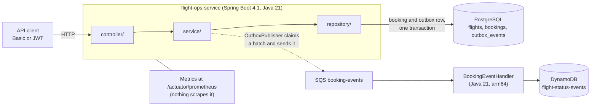
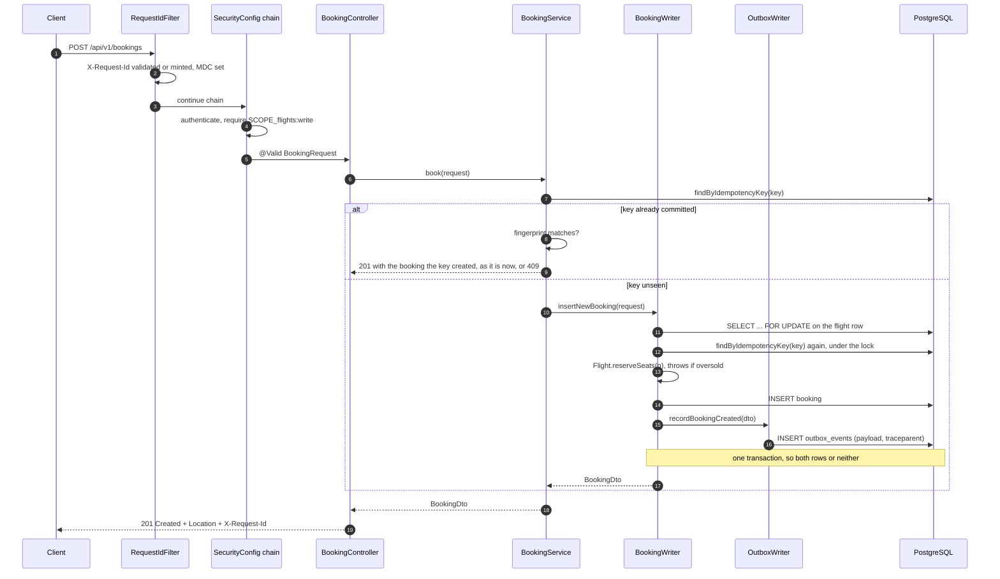
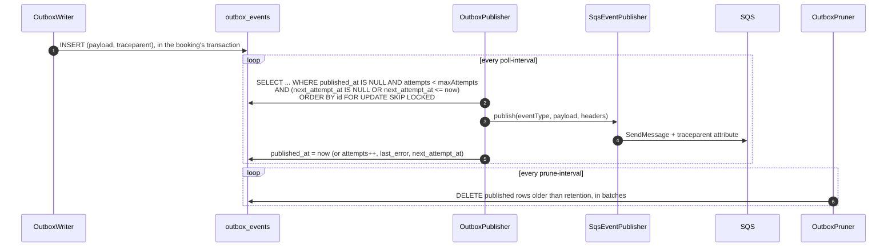
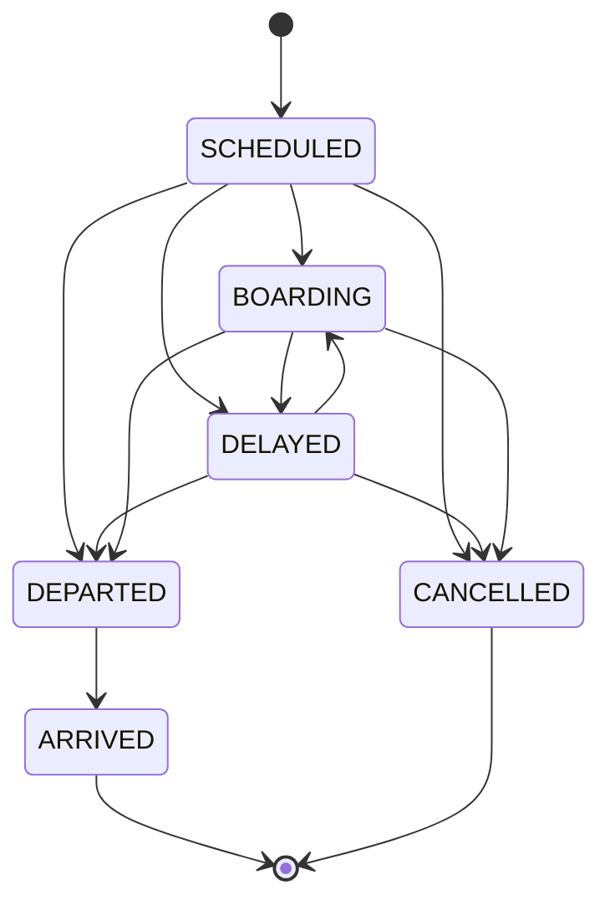
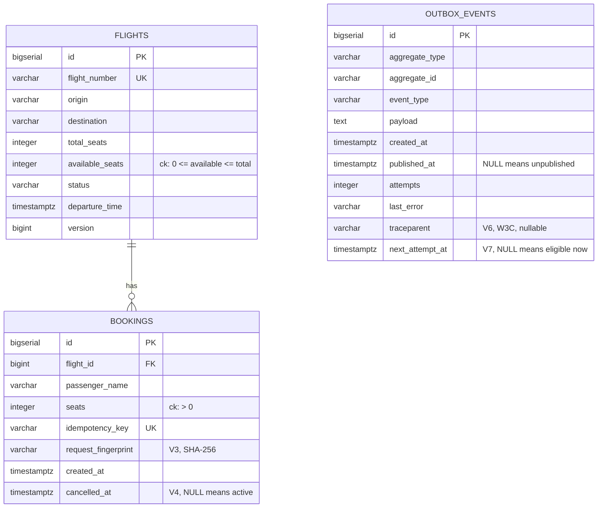
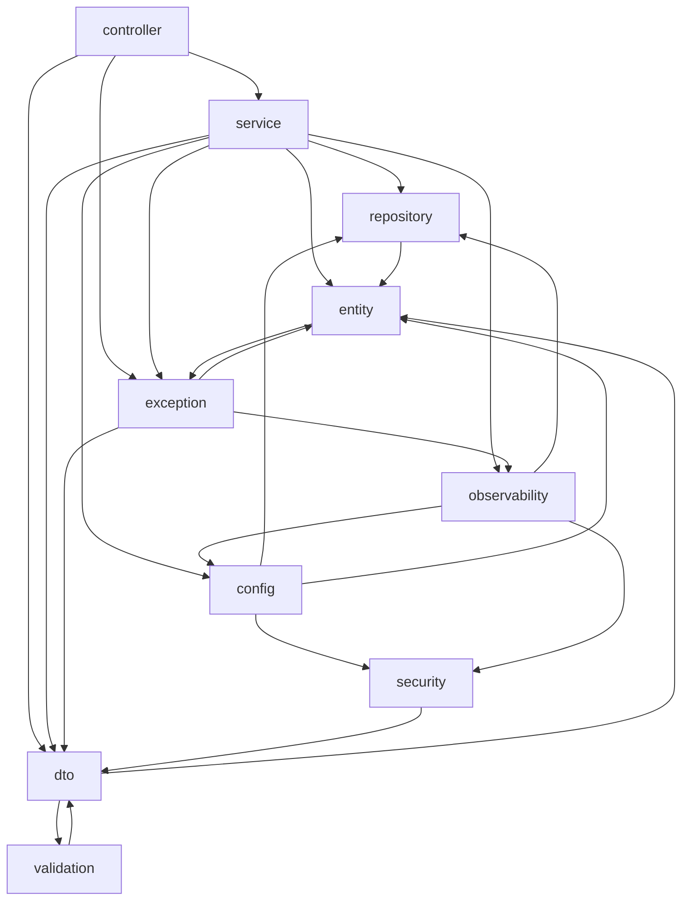
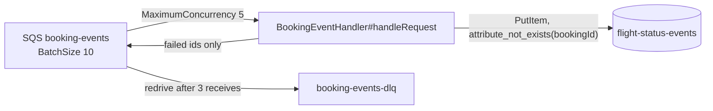

# Architecture

This document shows how the pieces fit, why they are arranged this way, and
where in the source each claim can be checked. On every CI run,
`scripts/refcheck.py` checks every path and `path#symbol` named here and
`scripts/linkcheck.py` checks every heading link. A rename that leaves this
document behind fails the `docs-check` job.

Each decision where I weighed alternatives has its own file in
[`adr/`](../adr/README.md), with the options I rejected. This document is the
map, and the ADRs hold the reasoning.

## Contents

| Section | What it covers |
|---|---|
| [The shape of it](#the-shape-of-it) | Two processes, one queue |
| [One booking, end to end](#one-booking-end-to-end) | `POST /api/v1/bookings`, method by method |
| [Idempotency, as a decision table](#idempotency-as-a-decision-table) | Replay, reuse and races on one key |
| [Concurrency: what is locked, and in what order](#concurrency-what-is-locked-and-in-what-order) | The flight row lock and its timeout |
| [The outbox](#the-outbox) | Writer, poller and pruner |
| [Flight status is a state machine](#flight-status-is-a-state-machine) | Transitions and bookable statuses |
| [Data model](#data-model) | Tables, migrations, `version` |
| [Repository layout](#repository-layout) | Where each part lives, and what stays at the web edge |
| [Module boundaries](#module-boundaries) | The ArchUnit rules |
| [The consumer half](#the-consumer-half) | The Lambda and its deployment package |
| [Where the seams are](#where-the-seams-are) | Extension points and their cost |
| [Trade-offs](#trade-offs) | Each choice against what production would do, and what is still open |

---

## The shape of it

Two processes and one queue. The service owns bookings and seat inventory and
answers HTTP synchronously. The Lambda owns a read-optimised projection of
booking events and never talks to the service.



The dotted line to SQS starts at `service/`, because `OutboxPublisher` is a
scheduled component there. `repository/` has no dependency on any transport.
`layers_are_respected` fails the build if `repository/` ever reaches into
`service/`, where `EventPublisher` and both of its implementations live.

That dotted line is the only asynchronous edge, and I kept it that way.
Everything a caller is told in a response has already committed to PostgreSQL,
and no response depends on SQS being up. That property is what the outbox
buys. It is the most important structural decision in the service, and
[ADR 0001](../adr/0001-transactional-outbox.md) explains it.

Bookings and flights are one service because the seat count and the booking
commit together.
`src/main/java/com/smit/flightops/service/BookingWriter.java#insertNewBooking`
takes the flight row lock, reserves the seats, inserts the booking and writes
the outbox row in one PostgreSQL transaction. As two services with a database
each, that becomes a saga: reserve seats in one, insert the booking in the
other, and release the seats again when the second step fails. The Lambda is
separate for other reasons: it scales with the queue, up to the five
concurrent invocations `lambda/template.yaml` allows, it can fail without
failing a booking, and it owns a different store.
[ADR 0008](../adr/0008-standalone-lambda-consumer.md) records why it is a plain
Lambda rather than a second Spring Boot service, which would consume SQS
around the clock. Inside the service, the boundary between layers is the
ArchUnit rule `layers_are_respected`, not a network hop.

Some parts are stubs. The authorisation rules, the locking, the idempotency,
the migrations and the event contract are production shapes. The user store is
two in-memory accounts, and the deployment has never been run against real
AWS. The README's [status table](../README.md#status) is the authoritative
list.

---

## One booking, end to end

`POST /api/v1/bookings` is the request to read first. Every hard part of this
service is on its path: validation, idempotency, a row lock, an invariant, an
event, and a response that has to be safe to retry.



Reading it in the source, in order:

| Step | Where | What it is responsible for |
|---|---|---|
| Correlation | `src/main/java/com/smit/flightops/observability/RequestIdFilter.java#doFilterInternal` | Runs ahead of Spring Security, so a 401 also carries `X-Request-Id`. Logs one INFO line for each answer of 400 or above outside `/actuator/`, except a failure that escapes the chain, which `ApiErrorController` logs |
| Authorisation | `src/main/java/com/smit/flightops/config/SecurityConfig.java#apiSecurityFilterChain` | One rule set for Basic and JWT alike |
| Binding and validation | `src/main/java/com/smit/flightops/dto/BookingRequest.java` | Bean Validation on the record components: the flight number is letters and digits, and the passenger name needs one character that is neither whitespace nor a format character, and has no control character or unpaired surrogate. Failures become 400 before any service code runs. Jackson refuses a `seats` with a decimal point or an exponent, `2.0` included (`accept-float-as-int` is off in `src/main/resources/application.yml`), a missing or null one, which a primitive `int` cannot hold, and `"2"` as text (`allow-coercion-of-scalars: false`), each as `400 MALFORMED_REQUEST`. The writes that take a body read JSON only, so any other `Content-Type`, YAML included, gets 415 first |
| Idempotency | `src/main/java/com/smit/flightops/service/BookingService.java#book` | Decides replay, conflict or insert. Holds no transaction of its own |
| The write | `src/main/java/com/smit/flightops/service/BookingWriter.java#insertNewBooking` | The transaction, the row lock, the key re-check under the lock, the seat arithmetic and the outbox row |
| The race loser | `src/main/java/com/smit/flightops/service/BookingWriter.java#recoverReplay` | Reads the winner in a fresh read-only transaction. `BookingService#book` holds no transaction, so the loser's has already rolled back. If `book` ever becomes transactional, `REQUIRES_NEW` still keeps the read in its own transaction |
| The event | `src/main/java/com/smit/flightops/service/OutboxWriter.java#recordBookingCreated` | `Propagation.MANDATORY`: it refuses to run outside the booking's transaction |
| The response | `src/main/java/com/smit/flightops/controller/BookingController.java#book` | 201 with a `Location` header. `UriComponentsBuilder` builds it from the id the database assigned |

The path depends on details in that table that are easy to miss:

- **`BookingService#book` is not transactional.** It cannot be. Usually the
  losing request fails inside `insertNewBooking`, which holds the flight row
  lock, finds the key already present and throws
  `LostIdempotencyRaceException`. When the same key is sent for a different
  flight, the two requests lock different rows. Then
  `uk_bookings_idempotency_key` throws `DataIntegrityViolationException`
  instead. Either way, the loser's transaction has rolled back by the time
  `book` catches the exception, and `recoverReplay` reads the winner in a
  transaction of its own. If `book` ever becomes transactional again, a
  recovery read without `REQUIRES_NEW` would join the loser's transaction.
  After a constraint violation, PostgreSQL has already marked that transaction
  aborted. That is how the race loser used to get a 409. `REQUIRES_NEW` keeps
  the read out of that transaction, but a loser that should get `201` would
  still fail. The exception leaving `insertNewBooking` would mark the shared
  transaction rollback-only, and its commit at the end of `book` would throw
  `UnexpectedRollbackException`, which would reach the client as a 500. A
  loser whose request differs from the winner's would still get
  `409 IDEMPOTENCY_KEY_REUSED`.

- **No winner to recover.** If `recoverReplay` finds no booking holding the
  key, the insert failed for some other reason. `book` then rethrows the
  original exception, with the `IllegalStateException` from `recoverReplay`
  attached as suppressed. It logs a WARN that ends `not a lost race`. A
  constraint violation on that path gets `409 DUPLICATE_REQUEST` from
  `src/main/java/com/smit/flightops/exception/GlobalExceptionHandler.java#handleDataIntegrity`,
  where it used to get a 500.
  `src/test/java/com/smit/flightops/service/BookingServiceTest.java#aViolationWithNoWinnerIsRethrown`
  pins the rethrow and the suppressed exception.

- **`OutboxWriter#recordBookingCreated` is `MANDATORY`.** Called outside a
  transaction, it would still appear to work. Spring Data would open a
  transaction for the save and the row would be written. The atomicity that
  justifies the whole outbox would be gone, with no error to say so.
  `MANDATORY` turns that mistake into an exception on the first call.

- **Framework errors keep their status.** Most Spring MVC exceptions
  implement `org.springframework.web.ErrorResponse` and carry the status
  Spring chose.
  `src/main/java/com/smit/flightops/exception/GlobalExceptionHandler.java#handleSpringWebError`
  reads that status back, so a wrong HTTP verb stays a 405 with its `Allow`
  header. A bare `@ExceptionHandler(Exception.class)` would turn it into a
  500. `ErrorResponse` is an interface, so
  `@ExceptionHandler(ErrorResponse.class)` does not compile. The handler
  catches `ServletException` and `ErrorResponseException` and pattern-matches
  with `instanceof`.

---

## Idempotency, as a decision table

The client sends `idempotencyKey` in the body. What happens next depends on
two questions: has that key committed, and is this the same request?

| Key seen before | Same request? | Outcome | Status | Where |
|---|---|---|---|---|
| No | n/a | Insert, debit seats, write the event | `201` | `BookingWriter#insertNewBooking` |
| Yes, committed | Yes | Return the original booking, debit nothing | `201` | `BookingService#book` |
| Yes, committed | No | Refuse, because the key already means something else | `409 IDEMPOTENCY_KEY_REUSED` | `BookingService#book` |
| Yes, in flight elsewhere | Yes | Wait on the flight row lock, find the key on the re-read, then read the winner | `201` | `BookingWriter#insertNewBooking`, `BookingWriter#recoverReplay` |
| Yes, in flight elsewhere | No | Lose the race (the re-read under the lock, or the unique index when the other request is for a different flight), then fail the fingerprint check | `409 IDEMPOTENCY_KEY_REUSED` | `BookingWriter#insertNewBooking`, `BookingWriter#recoverReplay` |

The unique index on `idempotency_key` is the backstop for the one case the row
lock cannot serialise: the same key sent for a different flight.

"Same request" is a SHA-256 over the normalised request
(`src/main/java/com/smit/flightops/dto/BookingRequest.java#fingerprint`),
stored on the row as `request_fingerprint` (V3). Comparing the key alone is the
bug this table exists to prevent. With a key-only check, a client that reuses
one key for a different passenger gets `201` and someone else's booking back.
No seats are debited for the booking it believes it just made. The unique
constraint cannot catch that, because it is doing its job: one booking per key.

`BookingIdempotencyTest` runs four 10-thread races, each on a single key: the
same request, different payloads, the last seat, and one key sent for two
flights. The last race reaches `uk_bookings_idempotency_key` on most runs. On
the others the first lookup or the re-read under the lock settles it, and the
assertions hold either way.

---

## Concurrency: what is locked, and in what order

Seat inventory is a counter that two requests will try to decrement at the same
moment. I chose a pessimistic row lock on the flight over an optimistic version
check:

```java
@Lock(LockModeType.PESSIMISTIC_WRITE)                     // FlightRepository#findByFlightNumberForUpdate
@Query("SELECT f FROM Flight f WHERE f.flightNumber = :fn")
Optional<Flight> findByFlightNumberForUpdate(@Param("fn") String fn);
```

Optimistic locking is the better default when contention is low, and seat sales
are the case it handles worst. The last few seats on a popular flight are where
every request collides. There, `@Version` turns each collision into a retry
storm at the moment the system is busiest. Pessimistic locking serialises those
requests instead. See [ADR 0002](../adr/0002-pessimistic-locking.md).

What keeps the lock from becoming an outage:

- **A bounded wait.** `SET lock_timeout = '3s'` runs once per connection as a
  session setting, through HikariCP's `connection-init-sql` in the `postgres`
  and `prod` profiles of `src/main/resources/application.yml`. No Java code
  issues it, so every lock the service takes gets the same bound, native SQL
  included. No query can forget a hint.
  [ADR 0002](../adr/0002-pessimistic-locking.md) explains why I did not use a
  per-query hint. A request that cannot get the lock fails within seconds with
  `503 LOCK_TIMEOUT`. Without the bound it would hold a connection until the
  pool was empty. H2 gets the same bound, spelled `SET LOCK_TIMEOUT 3000`.
  `LockTimeoutTest` lowers it to 250 ms on H2 and proves a lock timeout becomes
  a 503 with `Retry-After`. `LockTimeoutPostgresTest` runs in CI against
  PostgreSQL 17 and shows the 3 s `lock_timeout` itself firing, with SQLSTATE
  `55P03`, and the caller getting the same 503.

- **One lock order everywhere.** Booking and cancellation both take the flight
  row first and the booking row second
  (`src/main/java/com/smit/flightops/service/BookingWriter.java#cancelBooking`).
  Two paths that disagree about that order deadlock only under load, which is
  the worst place to find out.

- **A floor in the schema.** `ck_flights_seat_floor` (V2) makes
  `available_seats >= 0` a database constraint. Application code that gets the
  arithmetic wrong fails the write instead of overselling.

Read paths take no lock, and the outbox poller takes no flight locks. It
claims outbox rows with `FOR UPDATE SKIP LOCKED`
(`src/main/java/com/smit/flightops/repository/OutboxEventRepository.java#claimUnpublished`),
so N replicas drain disjoint batches with no leader election and no distributed
lock.

---

## The outbox

The outbox is split into a writer inside the booking transaction, a poller
outside it, and a pruner that stops the table growing forever.



Each of these choices prevents a specific failure:

1. **Publish, then mark.** A crash between the two republishes the event, and
   marking first would lose it. I chose at-least-once delivery, and the
   consumer's conditional write absorbs the duplicates.

2. **A ceiling in the claim.** The claim is `ORDER BY id`, so a row the
   transport structurally rejects is retried first each time its backoff
   ends, ahead of the live events behind it. `attempts < maxAttempts` drops
   it out of the claim and `outbox.dead` rises. An operator then re-drives it
   with
   `UPDATE outbox_events SET attempts = 0, next_attempt_at = NULL WHERE id = ?`.

3. **The writer captures the trace.** The poller runs later, sometimes minutes
   later, on a scheduler thread with no link to the request. A traceparent read
   there would be meaningless. The writer injects it at booking time
   (`src/main/java/com/smit/flightops/service/OutboxWriter.java#currentTraceparent`)
   and stores it on the row (V6). Micrometer's `Propagator` formats it. With
   no current span the writer stores no header, because a consumer cannot
   tell a made-up id from a real one.
   `OutboxTest.theDrainDoesNotOverwriteTheTrace` drains inside a different
   span, so that regression stays covered. The sampled flag follows
   `management.tracing.sampling.probability`, which Boot defaults to 0.1. Most
   values on the queue are real ids marked not-sampled, so check that before
   deciding a collector is dropping spans.

4. **`fixedDelay`, not `fixedRate`.** Under strain, `fixedRate` queues
   scheduler invocations behind each other. `fixedDelay` slows the polling
   down instead.

5. **Pruning by primary key.** `ORDER BY id` with a `LIMIT` and a
   per-run ceiling means no index on `published_at` is needed. That index would
   add a write to the booking transaction's hot path
   (`src/main/java/com/smit/flightops/repository/OutboxEventRepository.java#deletePublishedBefore`).

The outbox costs a table, a poller, up to one poll interval of latency and a
retention job. In return I get one recorded event per booking, at-least-once
delivery and a backlog I can query:
`SELECT count(*) FROM outbox_events WHERE published_at IS NULL` is both a lag
metric and an alert.

The transport itself is one interface,
`src/main/java/com/smit/flightops/service/EventPublisher.java`, with two
implementations: `LoggingEventPublisher` for local runs and `SqsEventPublisher`
for the `prod` profile. No business logic knows which transport is wired, and
adding one leaves `EventPublisher` unchanged, but it is more than one class.
There is no JMS publisher. For a JMS broker it is a publisher class behind
`@ConditionalOnProperty`, a `ConnectionFactory` bean and the vendor's client
library, a mode in
`src/main/java/com/smit/flightops/config/EventProperties.java#MODES`, a test,
and a new consumer, because the Lambda reads `SQSEvent`.
[ADR 0015](../adr/0015-event-transport.md) sets out that cost from the vendors'
documentation; none of it has been built or run here.

`app.events.publisher` picks the implementation, `log` or `sqs`, through
`@ConditionalOnProperty` on each publisher. `log` is the default
(`matchIfMissing = true` on `LoggingEventPublisher`), so a run on a laptop
never tries to reach AWS. The `prod` profile defaults to `sqs`.
`src/main/java/com/smit/flightops/config/AwsConfig.java` carries the same
condition, so a run in `log` mode builds no SQS client at all. `@Primary` and
`@Qualifier` only choose which bean is injected. Spring would still build
every candidate, including an SQS client on a machine with no credentials,
and `SqsEventPublisher` would stop startup for want of `SQS_QUEUE_URL`.
`@ConditionalOnProperty` decides whether the bean exists at all.

`EventProperties` refuses any other value at startup and names the property.
`OutboxPublisher` takes `EventProperties` as its first constructor argument,
and Spring resolves arguments in order. An unknown value therefore stops
startup with `app.events.publisher must be one of [log, sqs], not "<value>"`
(`src/test/java/com/smit/flightops/EventPropertiesTest.java#applicationStartupNamesTheProperty`).
Before this ordering, the context reported a missing `EventPublisher` bean,
which does not name the property. The startup log names the transport in use,
as in `Outbox publisher started with event transport 'sqs'`.

---

## Flight status is a state machine

`PATCH /api/v1/flights/{n}/status` used to accept any status from any status.
A cancelled flight could be moved back to `SCHEDULED` and start selling seats
again. The graph now lives in
`src/main/java/com/smit/flightops/entity/FlightStatus.java#canTransitionTo`:



I let a status always transition to itself, so a client retrying `DELAYED`
after a timeout gets `200` rather than `409`. I made `ARRIVED` and `CANCELLED`
terminal. Correcting a status recorded in error is a data-repair job with an
audit trail, and the PATCH endpoint is the wrong tool for it.

Which statuses are bookable is a separate question.
`src/main/java/com/smit/flightops/entity/FlightStatus.java#isBookable` answers
it with an exhaustive switch and no `default`. Adding a constant is then a
compile error until someone decides whether the new status accepts bookings.

---

## Data model

The schema is three tables and eight migrations. Flyway owns the PostgreSQL
schema, and `ddl-auto: validate` checks the entity mapping against it. A
mapping that drifts from the migrations fails at startup instead of at the
first query.
`src/test/java/com/smit/flightops/BookingIntegrationTest.java#migrationRanAndSchemaValidates`
runs on PostgreSQL 17 in a container. It asserts that `flyway_schema_history`
holds versions 1 to 8, and as many as there are migration files on the
classpath, so a misnamed file that Flyway skips fails the test.



| Migration | What it adds | Why it is its own migration |
|---|---|---|
| `V1__init.sql` | `flights`, `bookings` | The initial schema |
| `V2__seat_and_route_invariants.sql` | Seat and route CHECK constraints | The invariants the application enforces, restated where they cannot be bypassed |
| `V3__booking_request_fingerprint.sql` | `request_fingerprint` | Nullable, because rows written before V3 have no fingerprint. A hash of a request no one kept cannot be backfilled |
| `V4__booking_cancellation.sql` | `cancelled_at`, and a partial index on active bookings that V8 removes | Cancellation is a soft delete, so the row stays addressable and a repeated DELETE is safe |
| `V5__outbox.sql` | `outbox_events` + a partial index on unpublished rows | The poller's claim only ever reads unpublished rows, so the index only covers them |
| `V6__outbox_traceparent.sql` | `traceparent` | Diagnostics only: nullable, and with no index |
| `V7__outbox_next_attempt_at.sql` | `next_attempt_at` | A failed send waits before it is retried. Without it, the ten-attempt ceiling was used up in ten seconds at a one-second poll |
| `V8__drop_unused_active_booking_index.sql` | Drops `idx_bookings_active` | The planner only uses a partial index when the query repeats its predicate, and no query here filters on `cancelled_at`. It was write cost with no reader |

`version` on `flights` is JPA's optimistic-locking column, and it does real
work today. `BookingWriter#insertNewBooking` and `BookingWriter#cancelBooking`
take the row lock.
`src/main/java/com/smit/flightops/service/FlightService.java#updateStatus` and
`src/main/java/com/smit/flightops/service/FlightService.java#cancel` load the
flight without it. A status change that races a booking on the same flight is
caught at flush by `version` and answered with `409 CONCURRENT_MODIFICATION`.
Without `version`, the stale UPDATE would write back the old `available_seats`
and restore the seats the booking had just debited.

---

## Repository layout

```
├── src/main/java/com/smit/flightops/
│   ├── controller/     HTTP only: bind, validate, map to DTO, choose the
│   │                   status code; SortPolicy checks the sort and adds the
│   │                   tie-breaker
│   ├── service/        orchestration, transaction boundaries, the outbox
│   │                   writer, drain and pruner, and both event publishers
│   ├── entity/         Flight, Booking, FlightStatus, OutboxEvent: the
│   │                   invariants
│   ├── repository/     Spring Data JPA, the FOR UPDATE query, the SKIP LOCKED
│   │                   claim
│   ├── dto/            request and response records, and BookingCreatedEvent
│   │                   (the wire contract)
│   ├── exception/      the domain exceptions, GlobalExceptionHandler (the
│   │                   @RestControllerAdvice) and ApiErrorController
│   ├── security/       the JSON 401 and 403 writers
│   ├── observability/  RequestIdFilter, BookingMetrics, OutboxMetrics
│   ├── validation/     @DistinctEndpoints, a class-level Bean Validation
│   │                   constraint, and IsoInstantDeserializer, which takes only
│   │                   an ISO-8601 instant
│   └── config/         SecurityConfig, OpenApiConfig, AwsConfig, the
│                       @ConfigurationProperties records, TimeConfig, DataSeeder
├── src/main/resources/
│   ├── application.yml         profiles: default (H2), postgres, prod
│   └── db/migration/           the Flyway migrations, which own the PostgreSQL
│                               schema
├── src/test/java/              the service's tests
├── lambda/                     a separate Maven module with no parent: the SQS
│                               to DynamoDB consumer, its tests, template.yaml
│                               (SAM) and events/, the hand-written SQS fixtures
├── contracts/                  the event schema both modules test against
├── doc/                        the API reference, this document, the defect
│                               log, the deployment runbook and costs, and
│                               operations
├── adr/                        the decision records and their index
├── scripts/                    refcheck.py, linkcheck.py, numbers.sh
│                               --check-readme and sweeps.sh run in CI;
│                               numbers.sh recomputes the counts; demo.sh is
│                               the tour over HTTP
├── deploy/
│   ├── aws/                    up.sh, down.sh, cost-check.sh and render-aws.sh;
│   │                           the helpers lib.sh and ecr-image-exists.sh;
│   │                           selftest.sh, which runs down.sh, cost-check.sh,
│   │                           ecr-image-exists.sh and up.sh's checks in
│   │                           lib.sh against stubbed tools; the CloudFormation
│   │                           templates foundation.yaml and data.yaml; the
│   │                           eksctl cluster.yaml, version pinned; and
│   │                           README.md, the runbook that orders them
│   └── k8s/                    kustomize, and beside it namespace.yaml, which
│       │                       up.sh applies once, and secret.example.yaml, a
│       │                       template for the Secret up.sh creates
│       ├── base/               the manifests true in any environment
│       ├── overlays/aws/       image, IRSA annotation, queue URL, database URL
│       └── components/ingress/ separate, because applying it provisions a
│                               billed ALB
├── compose.yaml                PostgreSQL and the service in containers
│                               (defined, not run end to end)
├── Dockerfile                  multi-stage: a JDK and Maven build stage, then
│                               a JRE runtime
├── pom.xml, mvnw               the service's build; the wrapper pins Maven
├── README.md, CHANGELOG.md, CONTRIBUTING.md, SECURITY.md, LICENSE
└── .github/                    workflows/build-and-deploy.yml (build,
                                infra-lint, trivy-fs, docs-check and image on
                                every trigger, dependency-review on pull
                                requests, and the gated deploy),
                                workflows/codeql.yml, dependabot.yml
```

A DTO never reaches the repository, and an entity never reaches a controller.
Nothing in `service/`, `entity/` or `repository/` knows about HTTP. That stays
in the web edge: `controller/`, `exception/`, `security/`,
`observability/RequestIdFilter` and `config/SecurityConfig`. ArchUnit fails the
build if HTTP types leak inward or a controller touches an entity;
[Module boundaries](#module-boundaries) lists the rules.

---

## Module boundaries

`src/test/java/com/smit/flightops/ArchitectureTest.java` fails the build on the
rules in the table below. Its layer rule checks four things. Nothing may use
`controller`. Only `controller` may use `service`. Only `service` and `config`
may use `repository`. Only `service`, `repository`, `dto`, `exception` and
`config` may use `entity`. `observability` is not one of its layers, so its
edges are not checked. That is why `OutboxMetrics` may read
`OutboxEventRepository`. The diagram shows every package import in the main
code:



| Rule | What it prevents |
|---|---|
| `layers_are_respected` | A repository reaching back into a service, or anything reaching into `controller` |
| `controllers_do_not_touch_entities` | A LAZY proxy serialised outside its transaction, and a new column becoming public API without anyone deciding it should |
| `no_field_injection` | Untestable beans and a hidden required dependency |
| `no_java_util_logging`, `no_standard_streams` | Log lines that bypass the correlation pattern |
| `repositories_are_interfaces` | Hand-written persistence sneaking in beside Spring Data |
| `transactions_are_opened_only_in_the_service_layer` | A transaction opened in a controller, spanning the HTTP response |
| `time_comes_from_the_clock` | Any `java.time` `now()` that takes no `Clock`, `System.currentTimeMillis()`, `new Date()` or `Calendar.getInstance()` in main code, where an injected `Clock` belongs. It has no exemption. `BookingWriter` passes `clock.instant()` to the `Booking` constructor |
| `no_web_types_below_the_controller` | A service that cannot be called from a scheduler or a test |

I checked each rule against a planted violation before committing it. A rule
that has never failed has not been shown to work.

---

## The consumer half

The Lambda is a separate Maven build with no dependency on the service. A
shared event jar would make the two deploy together, and the queue exists to
remove that coupling.



The handler never sends to the DLQ. A reported message goes back to the queue,
and the queue's redrive policy in `lambda/template.yaml`
(`maxReceiveCount: 3`) moves it to `booking-events-dlq` after the third failed
receive.

- The contract between them is a file, `contracts/booking-created-v1.json`.
  A test on each side asserts against it, and neither test imports the other
  side's code. The module has 28 tests, and 6 of them are the consumer half of
  the contract.

- The handler is a plain `RequestHandler` with no framework. I did not use
  Spring Cloud Function, because its application context would start on every
  cold invocation. `DynamoDbClient` sits behind an initialisation-on-demand
  holder, so each execution environment builds it once and reuses it across
  warm invocations.

- Partial batch failure: the handler returns only the failed message ids.
  `FunctionResponseTypes: [ReportBatchItemFailures]` in `lambda/template.yaml`
  makes Lambda read that list. Without it, Lambda treats the invocation as a
  success and deletes every message in the batch, failures included. With it,
  one poison message does not redeliver the nine beside it that succeeded.

- The write is conditional on `attribute_not_exists(bookingId)`. SQS delivers
  at least once, so a redelivery of a message that already succeeded is a
  no-op, logged as `Duplicate ignored`.

- `seats` must be a whole number of at least 1. The handler's `MAPPER` refuses
  a string, a fraction, a null and a missing field, where Jackson's defaults
  would store `"2"` and `2.9` as two seats. The `BookingEvent` record
  rejects anything below 1 with
  `booking event has <n> for 'seats'; expected at least 1`. Each case is
  reported, so the message ends in the DLQ instead of DynamoDB
  (`lambda/src/test/java/com/smit/flightops/lambda/BookingEventHandlerTest.java#aSeatsValueThatIsNotAPositiveWholeNumberIsNotWritten`).
  The contract test parses with the same mapper.

- The sort key is `timestamp#bookingId`. The `bookingId` keeps two bookings on
  one flight in the same instant apart, and
  `lambda/events/sqs-same-instant.json` covers that case. Both sides format the
  timestamp with `uuuu-MM-dd'T'HH:mm:ss.SSSSSS'Z'`. DynamoDB sorts range keys as
  bytes, and `Instant.toString()` prints 0, 3, 6 or 9 fractional digits.
  `…:00Z` would then sort after `…:00.000001Z`, because `Z` is `0x5A` and
  `.` is `0x2E`. The contract test asserts that the `#` lands at index 27, so a
  pattern changed on one side only fails it.

- The producer's `traceparent` arrives as a message attribute. A missing
  attribute map, a missing `traceparent` key and a value sent as binary all
  give no log prefix. The handler matches the value against the W3C shape
  before logging it
  (`lambda/src/main/java/com/smit/flightops/lambda/BookingEventHandler.java#tracePrefix`).
  A message attribute is input from anyone who can send to the queue. A
  newline in it would put a fabricated line inside the log entry, and an
  unbounded attribute would be shipped to CloudWatch. A missing or malformed
  trace never fails a projection. `lambda/events/sqs-with-trace.json` carries
  one message with a trace and one without.

- Values from the body come from the same senders, so they are cleaned before
  they reach the log
  (`lambda/src/main/java/com/smit/flightops/lambda/BookingEventHandler.java#printable`).
  That covers the `bookingId` in `Processed booking` and the exception message
  in the `FAILED` line, because Jackson and `java.time` quote the input they
  rejected. Characters in the categories `Cc`, `Cf`, `Zl` and `Zp` become `?`.
  A value over 1,000 characters is cut there and ends in `...`
  (`lambda/src/test/java/com/smit/flightops/lambda/BookingEventHandlerTest.java#bodyValuesAreLoggedOnOneBoundedLine`).

- `ScalingConfig.MaximumConcurrency: 5` on the SQS event caps a backlog at five
  concurrent invocations. It takes nothing from the account pool, which
  reserved concurrency would, so it deploys on a small quota. Messages over the
  cap wait in the queue. Throttling would send them back with a raised receive
  count, towards the DLQ. The value must be 2 to 1000, and it limits only the
  poller, so an account pool that runs dry can still throttle.

- The deployment package carries one HTTP client. At SDK 2.55.2,
  `software.amazon.awssdk:dynamodb` pulls in `apache5-client` and
  `netty-nio-client` transitively. `lambda/pom.xml` excludes both, and also
  excludes `apache-client`, so an SDK bump that brings it back cannot slip in.
  It adds `url-connection-client` (34 KB, no transitive dependencies), the
  client that AWS documents for Lambda. The jar went from 16.6 MiB to 10.3 MiB.
  The client holder names `UrlConnectionHttpClient`, because the SDK's own
  discovery ranks Apache 5 first. A dependency that brought Apache 5 back would
  otherwise take over. The cost is no HTTP/2, no tunable pool and synchronous
  calls only, which suits one `PutItem` per message.

- `joda-time` stays. It looks like 247 dead classes and 644 KB, and excluding
  it fails the `EventLoader` tests with
  `ClassNotFoundException: org.joda.time.DateTime`. `EventLoader` builds its
  deserialiser through `LambdaEventSerializers`, which registers a Jackson
  Joda module across the whole event model. A comment in `lambda/pom.xml` says
  so.

- SnapStart is off, and `lambda/template.yaml` says why. No cold start has
  been measured on this function. The ranges in `lambda/pom.xml` and
  `lambda/template.yaml` are published figures from elsewhere, labelled as
  such.

- Maven builds the package. `deploy/aws/up.sh` step 3 runs
  `./mvnw -B -q -f lambda/pom.xml clean package`, then
  `sam deploy --template-file lambda/template.yaml`. `CodeUri` is
  `target/booking-event-handler.jar`, which SAM resolves against the
  template's directory, so there is no `sam build`. SAM builds in a scratch
  copy of the `CodeUri` directory, where the Lambda tests cannot find
  `../contracts`. A step in CI's `build` job checks that `CodeUri` names a
  built file and that the file holds the handler class.

---

## Where the seams are

These are the places I expect the design to be extended, and what each one
costs:

| Seam | Swap in | Cost |
|---|---|---|
| `EventPublisher` | A JMS broker (Solace PubSub+, TIBCO EMS), Kafka, EventBridge | `EventPublisher` itself does not change, because the payload is already serialised. A JMS broker would take a publisher behind `@ConditionalOnProperty`, a `ConnectionFactory` bean and the vendor's client library, a mode in `src/main/java/com/smit/flightops/config/EventProperties.java#MODES`, a test, and a new consumer, because the Lambda reads `SQSEvent`. [ADR 0015](../adr/0015-event-transport.md) sets out each option from the vendors' documentation; none has been built or run here |
| `spring.security.oauth2.resourceserver.jwt.issuer-uri` and `.audiences` | Cognito, Okta, Entra | Configuration: set both. `issuer-uri` alone accepts a token the issuer minted for another client in the tenant. The rules already treat a JWT scope and a Basic authority identically |
| `Clock` (`src/main/java/com/smit/flightops/config/TimeConfig.java`) | A fixed clock in a test | Already used everywhere |
| `management.opentelemetry.tracing.export.otlp.endpoint` | An OTLP collector | An environment variable. Ids are already generated and already on every log line |
| The outbox poller | Debezium reading the WAL | A replication slot, a connector to operate, and a disk that fills if the consumer stops. I considered it and rejected it at this size |
| The database | Oracle | Two native outbox queries rewritten, the session-wide lock-wait bound narrowed to per-query hints, and a second set of migrations. [ADR 0016](../adr/0016-oracle-port.md) sets this out from documentation, as a proposal; none of it has been built or run |

---

## Trade-offs

Each row is a choice I made, set against what a production system would do.
The README keeps a short version of this table under
[Trade-offs and still open](../README.md#trade-offs-and-still-open).

| Current | Production would be | Why it is this way |
|---|---|---|
| Two users in an `InMemoryUserDetailsManager` | Cognito, Okta or Entra behind `issuer-uri` and `audiences` | The rules are real and tested, and the user store is a stub. The resource-server half is wired and activates when an issuer is configured, so the swap is configuration: set both properties, as [SECURITY.md](../SECURITY.md#authentication-and-authorisation) shows. |
| Idempotent replay returns 201 | 200, arguably | It answers with the original status, Stripe-style, and the booking the key created, so the body matches the first response until the booking is cancelled, when `cancelledAt` is set. "201 Created" for something not created this time is a fair challenge. I documented it and left it. |
| Idempotency keys never expire. The key is a `NOT NULL` column of the booking row under `uk_bookings_idempotency_key`, so the unique index grows by one entry per booking | Keys valid for a stated window (Stripe's documentation says a key may be removed once it is at least 24 hours old), after which a replay is a new request | Cancellation sets a timestamp and never deletes the row (`src/main/resources/db/migration/V4__booking_cancellation.sql`), so a cancelled booking keeps its key and a late replay returns it instead of booking again (`src/test/java/com/smit/flightops/ErrorContractTest.java#replayAfterCancellationDoesNotRebook`). A window would bound the index, but a replay after it would book again, a contract change clients have to be told about. It would also need a new migration, because applied ones are never edited. |
| A poller drains the outbox | Debezium reading the WAL | A poll every second (`app.outbox.poll-interval` defaults to 1000 ms) costs one indexed query per replica per second and adds up to a second of latency. CDC removes both and adds Kafka Connect, a connector to operate and a replication slot that fills the disk if the consumer stops. |
| Retention is a batched `DELETE` on a schedule | A partitioned table, dropping old partitions | Detaching and dropping an old partition is O(1) and a delete is not, which matters from roughly the first hundred million rows. Below that, partitions add a maintenance job and an outage when that job fails. The pruner is one short class, and each run is bounded: batches of 1,000 rows by default, and at most 50 batches (`src/main/java/com/smit/flightops/service/OutboxPruner.java#MAX_BATCHES_PER_RUN`). |
| No circuit breaker | Resilience4j | Besides the database, SQS is the one outbound dependency (and the token issuer, once one is configured). The outbox already absorbs an SQS failure: a down queue leaves rows unpublished, and a later drain retries them after a backoff, up to the attempt ceiling in [The outbox](#the-outbox). Each send is bounded at 5 s (`src/main/java/com/smit/flightops/config/AwsConfig.java#sqsClient`) and runs on the poller, never on a request thread. |
| Contract tests share a JSON file | Pact, with a broker and a `can-i-deploy` gate in CI | The file catches the change that breaks the consumer, which is the whole job while both modules live in one repository. A broker pays off when the consumers are other teams' services. |
| The service's traces are generated and not exported. The trace id crosses the queue as a message attribute, and the Lambda logs it | An OTLP collector on both sides, so the queue hop is one waterfall | Trace and span ids are on the service's request log lines, and the request id is on every response the application handles. `BookingEventHandler` logs the producer's `traceparent`, so two log greps follow one booking end to end. Export from the service is one property away ([Where the seams are](#where-the-seams-are)). The Lambda would need an exporter in a function kept small for its cold start: 10.3 MiB, with a 34 KB HTTP client (`lambda/pom.xml`). No cold start has been measured. |
| H2 uses `create-drop` | Flyway and `validate`, as PostgreSQL already has | The migrations are written for PostgreSQL, and running them on a throwaway in-memory database buys nothing. The PostgreSQL tests in CI apply them and validate the entities against the result. |
| `lambda/events/*.json` are written by hand, and their `md5OfBody` and `md5OfMessageAttributes` values are placeholders | Messages captured from a real queue | Nothing in the code reads either field. The files are fixtures for the tests and for `sam local invoke`, and none of them is captured queue traffic. |

### Still open

| What happens | What should happen | The fix |
|---|---|---|
| There is no rate limiting. A single caller with valid credentials can take every connection in the pool. | A token bucket per principal at the gateway, or Bucket4j in front of the write endpoints. | Out of scope for the service. It belongs at the ingress, and I would sooner say so than add a half-measure here. |
