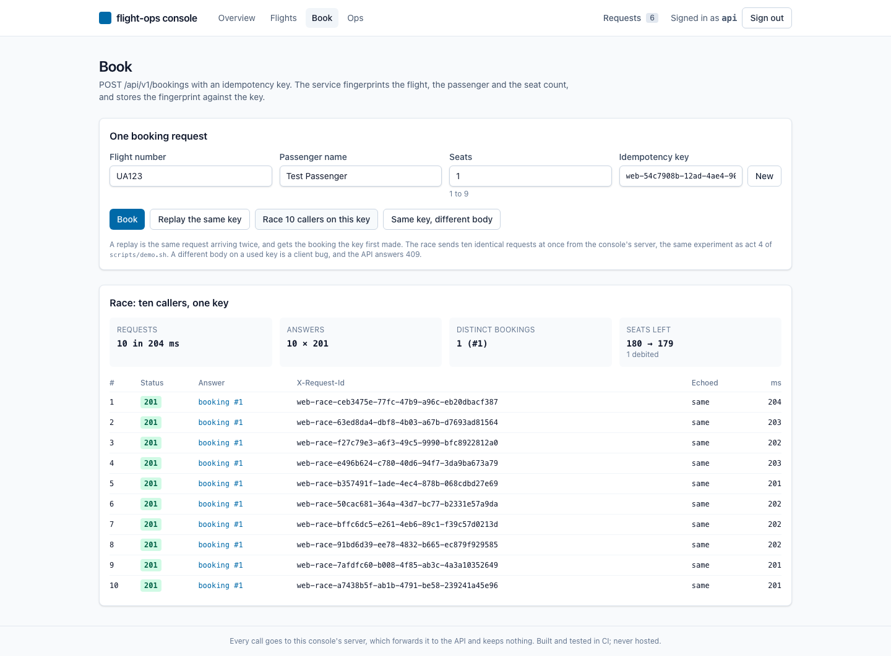
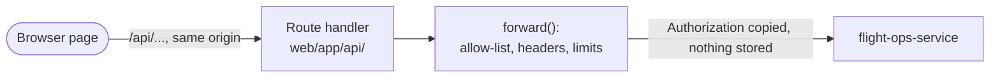

# Console

A browser front end for every operation of flight-ops-service. You sign in with
one of the service's two accounts, then list, create and move flights, book
seats with an idempotency key, replay a booking, send ten identical bookings at
once, cancel, and read the health endpoints and the meters. Every call is shown
in a request log with the request id the console sent and the one the service
echoed.

It is built and tested in CI on every push or pull request to `main`, never
hosted. [ADR 0017](../adr/0017-web-console.md) records why it is shaped the way
it is.



## Run it

Node 24 (`.nvmrc`) and the service on port 8080. From the repository root, in
one terminal:

```bash
./mvnw spring-boot:run
```

and in a second:

```bash
cd web && npm ci && npm run build && npm start
```

Open <http://localhost:3000> and sign in as `api` / `dev-secret`, or as `ops` /
`dev-ops` for the actuator pages. Those are the service's default accounts;
[doc/api.md](../doc/api.md#authentication) explains them.

`API_BASE_URL` tells the console's server where the API is. It defaults to
`http://localhost:8080`, must be an origin with no path, and is read on each
request, so the same build can point anywhere.

## Pages

| Page | What it shows | Calls it makes |
|---|---|---|
| `/` | Sign-in, anonymous health, four guided demos | `GET /actuator/health`; `GET /api/v1/flights?size=1` to check the credential |
| `/flights` | Search by route, sort, page; create a flight with per-field errors | `GET /api/v1/flights`, `POST /api/v1/flights` |
| `/flights/{flightNumber}` | The flight, the moves its status allows, any status on request, cancel, its bookings | `GET`, `PATCH .../status` and `DELETE /api/v1/flights/{flightNumber}`; `GET /api/v1/bookings?flightNumber=` |
| `/book` | Book, replay the same key, change the body on the same key, the race | `GET /api/v1/flights/{flightNumber}`, `POST /api/v1/bookings`, and the console's own `POST /api/race` |
| `/bookings/{bookingId}` | One booking and its cancellation, which is idempotent | `GET` and `DELETE /api/v1/bookings/{bookingId}` |
| `/ops` | Health, liveness and readiness without credentials; health and seven meters as `ops` | `GET /actuator/health`, `.../liveness`, `.../readiness`, `/actuator/metrics/{name}` |

Each API error is shown with its code, its status, the service's message and,
for the codes the console knows, one line on what the code means. Field errors
land next to their fields.

## How a call travels



The page never calls the API itself. It calls this console's own origin under
`/api/`, and `web/lib/proxy.ts#forward` passes an allow-listed subset on:

* `/api/v1/...` with `GET`, `HEAD`, `POST`, `PATCH` and `DELETE`;
* `/actuator/health`, its liveness and readiness groups and
  `/actuator/metrics/{name}`, read-only.

Everything else, the other actuator endpoints, the OpenAPI document and Swagger
UI included, answers `404 CONSOLE_PATH_REFUSED` without reaching the API. A
write under `/actuator` answers `405` with an `Allow` header.

Four request headers go upstream: `Authorization`, `Content-Type`, `Accept` and
`X-Request-Id`. Cookies, `Origin`, `Host` and forwarding headers do not. On the
way back only `Content-Type`, `Location`, `Retry-After`, `X-Request-Id`,
`Allow` and `Accept` pass, and every answer carries `Cache-Control: no-store`.
`Location` is cut to its path, so a new flight's link opens on the console.

`WWW-Authenticate` is dropped on purpose. Passed through, it would make the
browser open its own Basic dialog on every 401 and remember what was typed for
the whole origin.

The console's own refusals use the service's `{code, message, timestamp}`
shape, with codes that start with `CONSOLE_`:

| Status | Code | When |
|---|---|---|
| 400 | `CONSOLE_BAD_REQUEST` | The race body is not one JSON object |
| 403 | `CONSOLE_CROSS_SITE_REFUSED` | The browser marked the request `Sec-Fetch-Site: cross-site` |
| 404 | `CONSOLE_PATH_REFUSED` | The path is outside the allow-list |
| 405 | `CONSOLE_METHOD_REFUSED` | A method the path does not take, such as a write under `/actuator` |
| 413 | `CONSOLE_BODY_TOO_LARGE` | A body over 64 KiB |
| 500 | `CONSOLE_MISCONFIGURED` | `API_BASE_URL` is not an origin |
| 502 | `CONSOLE_UPSTREAM_UNREACHABLE` | The API did not accept the connection |
| 504 | `CONSOLE_UPSTREAM_TIMEOUT` | The API did not answer within 15 s |

## Where the credential lives

In React state, and nowhere else: not in `localStorage`, `sessionStorage` or a
cookie. The console's server copies it onto the one upstream request and drops
it. A reload signs you out; that is the price of storing nothing, and the
end-to-end tests check it.

## Why the race runs on the server

A browser opens at most six HTTP/1.1 connections to one origin and queues the
rest, so ten `fetch()` calls from a tab are not ten concurrent requests.
`web/lib/race.ts#runRace` sends the ten from the console's server in the same
tick, with byte-identical bodies and one idempotency key, and returns every
answer. Act 4 of `scripts/demo.sh` runs the same experiment with
`xargs -P 10 curl`; the console shows it on one screen: ten `201`s with the
same booking id, and the flight's seat count down by the seats of one booking.

## Tests

| Command | What it runs |
|---|---|
| `npm run lint` | ESLint with Next.js's core web vitals and TypeScript rules, no warnings allowed |
| `npx tsc --noEmit` | The type-checker, strict, with unchecked index access |
| `npm test` | Vitest: the proxy and the race against a stubbed `fetch`, the error classifier, the request log, two components in jsdom, and a test that reads `FlightStatus.java` and fails if the console's copy of the transition table drifts from it |
| `npm run e2e` | Playwright on Chromium against the built console and a running service: sign-in and sign-out, flights, bookings, replays and the race, validation, the proxy's refusals and the ops pages |

`npm run e2e` starts the console itself on port 3100 and expects the service
at `API_BASE_URL`. Each run creates flights with fresh numbers, so it needs no
clean database. CI runs it against the service's own jar on the default H2
profile. `scripts/numbers.sh` prints how many tests each suite declares.

## What it does not do

* **No hosting.** There is no Dockerfile, Compose service or manifest for the
  console, and nothing deploys it.
* **No login of its own.** It uses the service's accounts, and a reload signs
  out.
* **No server-side rendering of data.** Every page is a client component; the
  console's server only forwards.
* **No offline use or caching.** Each view asks the service again.
