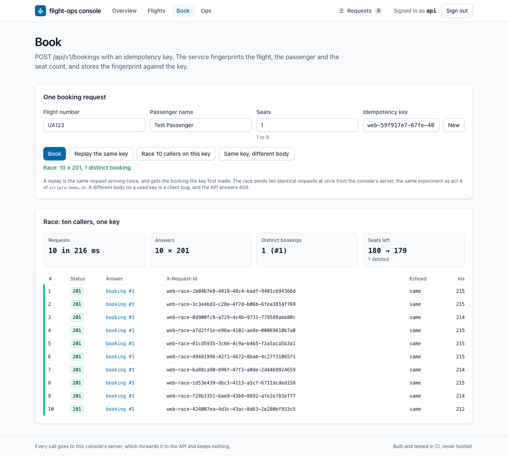
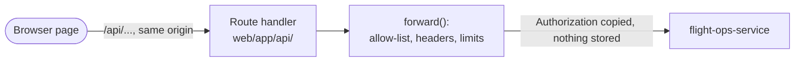
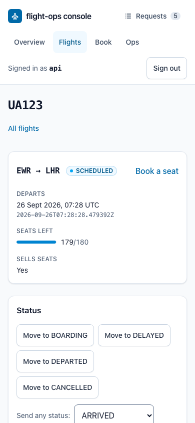

# flight-ops console

A Next.js and strict TypeScript front end for every operation of
flight-ops-service. You sign in with one of the service's two accounts, then
list, create and move flights, book seats with an idempotency key, replay a
booking, send ten identical bookings at once, cancel, and read the health
endpoints and the meters. A request log lists the tab's last twenty calls, with
the request id the console sent and the one the service echoed. The race is one
call there, answered by the console itself, and the ids of its ten requests are
in the race's own table.

It is built and tested in CI on every push or pull request to `main`, never
hosted. [ADR 0017](../adr/0017-web-console.md) records why it is shaped the way
it is.

What is worth reading here:

* [How a call travels](#how-a-call-travels): the browser only ever calls the
  console's own server, which forwards an allow-listed set of paths and
  headers, so the API needed no CORS policy.
* [Where the credential lives](#where-the-credential-lives): in React state
  only, with no cookie and no storage; the end-to-end tests check that a reload
  signs you out.
* [Why the race runs on the server](#why-the-race-runs-on-the-server): a
  browser queues requests beyond six per origin on HTTP/1.1, so ten `fetch()`
  calls from one tab are not ten concurrent requests; the console's server
  sends them instead.



## Run it

Node 24.15 or a later 24 (`.nvmrc` names the major, `engines` in
`package.json` the floor), a JDK 21 for the service
([CONTRIBUTING.md](../CONTRIBUTING.md#use-jdk-21)), and the service on port
8080. From the repository root, in one terminal:

```bash
./mvnw spring-boot:run
```

and in a second terminal, also from the repository root:

```bash
cd web && npm ci && npm run build && npm start
```

Open <http://localhost:3000> and sign in as `api` / `dev-secret`, or as `ops` /
`dev-ops` for the actuator pages. Those are the service's default accounts;
[doc/api.md](../doc/api.md#authentication) explains them.

`API_BASE_URL` tells the console's server where the API is. It defaults to
`http://localhost:8080`, must be an origin with no path, and is read on each
request, so the same build can point anywhere.

## Pages

| Page | What it shows | Calls it makes |
|---|---|---|
| `/` | Sign-in, anonymous health, four guided demos | `GET /actuator/health`, without credentials and then with them to check the password; `GET /api/v1/flights?size=1` for an account that sees no health components, to learn whether it holds the API scopes |
| `/flights` | Search by route, sort, page; create a flight with per-field errors | `GET /api/v1/flights`, `POST /api/v1/flights` |
| `/flights/{flightNumber}` | The flight, the moves its status allows, any status on request, cancel, its bookings | `GET`, `PATCH .../status` and `DELETE /api/v1/flights/{flightNumber}`; `GET /api/v1/bookings?flightNumber=` |
| `/book` | Book, replay the same key, change the body on a key a Book has used, the race | `GET /api/v1/flights/{flightNumber}`, `POST /api/v1/bookings`, and the console's own `POST /api/race` |
| `/bookings/{bookingId}` | One booking and its cancellation, which is idempotent, and refused with `409 BOOKING_NOT_CANCELLABLE` for an active booking once its flight has departed or arrived | `GET` and `DELETE /api/v1/bookings/{bookingId}` |
| `/ops` | Health, liveness and readiness without credentials; health and seven meters as `ops` | `GET /actuator/health`, `.../liveness`, `.../readiness`, `/actuator/metrics/{name}` |

Each API error is shown with its code, its status and the service's message. A
401, a 403, a 503, an answer from the console's own server and no answer at all
also get a one-line hint on what to do next. Field errors land next to their
fields.

## How a call travels


```mermaid
flowchart LR
  page([Browser page]) -->|"/api/..., same origin"| route["Route handler<br/>web/app/api/"]
  route --> forward["forward():<br/>allow-list, headers, limits"]
  forward -->|"Authorization copied, nothing stored"| api[flight-ops-service]
```

The page never calls the API itself. It calls this console's own origin under
`/api/`, and `web/lib/proxy.ts#forward` passes an allow-listed subset on:

* `/api/v1/...` with `GET`, `HEAD`, `POST`, `PATCH` and `DELETE`;
* `/actuator/health`, its liveness and readiness groups, `/actuator/metrics`
  and `/actuator/metrics/{name}`, read-only.

Everything else, the other actuator endpoints, the OpenAPI document and Swagger
UI included, answers `404 CONSOLE_PATH_REFUSED` without reaching the API. A
write to one of the forwarded actuator paths answers `405` with an `Allow`
header. `OPTIONS` never reaches `forward`: Next answers it on any `/api/` path,
refused ones included, with `204`, an `Allow` header that lists `OPTIONS` and
the methods the route exports, and no CORS headers. `e2e/ops.spec.ts` sends one
from another origin and checks that no `Access-Control-*` header comes back. A path with a malformed percent
escape, such as `/api/v1/%zz`, never reaches `forward` either: Next answers it
with a bare `500` in plain text, outside the envelope and without the headers
set in `web/next.config.ts`.

Four request headers go upstream: `Authorization`, `Content-Type`, `Accept` and
`X-Request-Id`. Cookies, `Origin`, `Host` and forwarding headers do not. On the
way back only `Content-Type`, `Location`, `Retry-After`, `X-Request-Id`,
`Allow` and `Accept` pass, and every answer carries `Cache-Control: no-store`.
`Location` is cut to its path, so a new flight's link opens on the console.
The API's answer is read in full before it is relayed, so a stall or a dropped
connection part-way through becomes a `504` or a `502` rather than a cut-off
body.

`WWW-Authenticate` is dropped on purpose. Passed through, it would make the
browser open its own Basic dialog on every 401 and remember what was typed for
the whole origin.

The console's own refusals use the service's `{code, message, timestamp}`
shape, with codes that start with `CONSOLE_`:

| Status | Code | When |
|---|---|---|
| 400 | `CONSOLE_BAD_REQUEST` | The race body is not one JSON object |
| 403 | `CONSOLE_CROSS_SITE_REFUSED` | The browser marked the request `Sec-Fetch-Site: cross-site` |
| 404 | `CONSOLE_PATH_REFUSED` | The path is outside the allow-list |
| 405 | `CONSOLE_METHOD_REFUSED` | A method the path does not take, such as a write to a forwarded actuator path or a `PUT` under `/api/v1` |
| 413 | `CONSOLE_BODY_TOO_LARGE` | A body over 64 KiB, counted as it arrives, so an endless one is cut off |
| 415 | `CONSOLE_UNSUPPORTED_MEDIA_TYPE` | The race body was not sent as `application/json`, which the API needs on every other write |
| 500 | `CONSOLE_MISCONFIGURED` | `API_BASE_URL` is not an origin |
| 502 | `CONSOLE_UPSTREAM_UNREACHABLE` | The API did not accept the connection, or dropped it before its answer was complete |
| 504 | `CONSOLE_UPSTREAM_TIMEOUT` | The API did not finish its answer within 15 s |

One more code never leaves the browser: `CONSOLE_BAD_CREDENTIALS`, which the
sign-in form shows when the typed name or password cannot be sent as HTTP Basic,
such as a user name with a colon in it (`lib/session.tsx`). No request is made,
so the console's server never sees it, and it is not one of the nine above.

`/api/race` is a route of its own and takes only `POST`. Next answers a `GET`,
`HEAD`, `PUT`, `PATCH` or `DELETE` there itself, with a bare `405`: no body and
no `Allow` header. `e2e/ops.spec.ts` checks the `GET`.

## Where the credential lives

In React state, and nowhere else: not in `localStorage`, `sessionStorage` or a
cookie. The console's server copies it onto each upstream request, ten for a
race, and drops it. A reload signs you out; that is the price of storing
nothing, and the end-to-end tests check it.

## Why the race runs on the server

A browser opens at most six HTTP/1.1 connections to one origin and queues the
rest, so ten `fetch()` calls from a tab are not ten concurrent requests.
`web/lib/race.ts#runRace` sends the ten from the console's server in the same
tick, each with the body the page sent, byte for byte, and so one idempotency
key, and returns every answer. Act 4 of `scripts/demo.sh` runs the same
experiment with `xargs -P 10 curl`; the console shows it on one screen: ten
`201`s with the same booking id, and the flight's seat count down by the seats
of one booking.

## Design

Beyond Next.js, React and Tailwind, the console has no UI dependencies: no
component library, no icon pack and no web font. The pages use the system font
stack, the icons are inline SVGs in `components/icons.tsx`, and the parts every
page shares (buttons, fields, cards, status badges, the seat bar, key and value
lists, skeletons, empty states and stat tiles) are in `components/ui.tsx`.

The tokens are in `app/globals.css`: one accent colour, two corner radii and two
shadows. Surfaces are slate and the accent is sky. Colour otherwise carries
meaning only: each flight status has its own, and an HTTP answer is green for a
2xx, amber for a 4xx, orange for a 409 and red for a 5xx. An error banner is
coloured by what went wrong instead: violet when the console's own server
answered in the API's place or could not be reached, and otherwise red for a
401, a 403 or a 5xx other than a 503, orange for a 409 or a 503, grey for a 404
and amber for any other refusal. Text keeps at least 4.5:1 contrast in both
schemes, apart from a disabled or busy button, and the flight list or a
flight's bookings while a newer answer is loading, which are dimmed. A field's
border and the focus outline keep at least 3:1 against what surrounds them. The
ratios are worked out from the colour values; no test measures them. The dark
scheme follows the system setting, with no toggle. Every link, button and field
shows an outline in the accent colour when the keyboard reaches it, and the only
motion is a colour transition, left out when the system asks for less motion.

Below 1280 px, and at any width where touch is the main input, such as the
1366 px tablet the tests use, every button, nav link, field and select is at
least 44 px tall, and every field has 16 px text, so iOS does not zoom in when
one takes focus. A link in a table, such as a flight's number or a booking's id,
keeps the row short, and a tap anywhere in its cell follows it. A desk with a
mouse keeps a denser layout from 1280 px up. The navigation wraps onto its own
row rather than folding into a menu, and wide tables scroll inside their own box
instead of widening the page. Where the navigation wraps under the brand and the
Requests button, the keyboard still follows the page's own order: the brand, the
navigation, then Requests and the account. That is the order a desktop and a
screen reader follow too, so the one step back up stays inside the header. On a
phone the tables also drop their secondary columns: a flight's status moves
under its number and its departure under its route, a long passenger name is cut
short with the whole name in its title, and the request log puts the id sent
under the call, with the answer beside them and a long error code broken only
after an underscore. Below 1024 px a booking's times give way to a "cancelled"
tag. From 640 px up the flight list wraps a departure time rather than scroll
sideways, so the edge of its box never cuts a seat count.

The request log opens as a drawer over the foot of the page and takes the
keyboard's focus, since it comes last in the page. Escape inside it closes it
and hands the focus back to the Requests button, and the page gains room to
scroll its end clear of the drawer. On a flight's page, Escape inside the
"Cancel flight?" question answers it as Keep it does: the flight is kept and
the focus goes back to Cancel flight. A button that is busy keeps the focus and
ignores presses, rather than going disabled and dropping it. A press that takes
its own button away passes the focus on: an accepted status move to the group of
moves that follow, the pager, on reaching its first or last page, to its other
button, and a Next or Previous whose page fails to arrive, to the flight
list's Try again or, on a flight's page, to its bookings' Refresh. Signing in,
signing out and a Try again that brings back a flight's page, a booking's page
or a page of the flight list all move the focus to the page's title, and a
change of account is announced. `e2e/auth.spec.ts`, `e2e/flights.spec.ts`,
`e2e/bookings.spec.ts` and, for the request log, `e2e/ops.spec.ts` check in a
browser where each of these leaves the focus, and the announcement. Only
`components/ui.test.tsx` checks that a busy button ignores presses, in jsdom.
The race's answers sit in a box that takes the focus, so a keyboard can scroll
them sideways when no row holds a link.



## Tests

| Command | What it runs |
|---|---|
| `npm run lint` | ESLint with Next.js's core web vitals and TypeScript rules, no warnings allowed |
| `npx tsc --noEmit` | The type-checker, strict, with `tsconfig.json#noUncheckedIndexedAccess`, so the type of a read by index includes `undefined` |
| `npm test` | Vitest: the proxy and the race against a stubbed `fetch`, a race call that times out included, the `/api` route's method exports, `OPTIONS` left out, and its `405` for a `PUT`, the browser's API client and the sign-in probe, a component that calls the API not rendered again when its call is logged, the error classifier and its hints, with a check that it knows every code `lib/proxy.ts` and `lib/race.ts` send, the request log, the resource hook, its pending state and a write that wins over an older read, the helpers that name a page from its address, and in jsdom the shared parts in `components/ui.tsx` (button tones and the busy state, field wiring, the seat bar, page titles, links and the Location mapping), the error banner, a meter card given the actuator's `NaN` for a gauge with no fresh count or a 404 for a name the service lacks, the booking form's replay comparison, a replay that comes back as a different booking, and the resent body, status line and its colour after a race, and seat counts, the race's answers, whose box is a named region with a tab stop, checked with ten refusals that hold no link, the transition control and the pager, including where each leaves the focus, and the request log drawer's focus on Escape and on Close, its copy buttons, its shape below 640 px and its change of shape when the screen crosses that width, with a focused copy button keeping the focus, and the one line that says what was copied until 1.5 s after the last copy; and a test that reads `FlightStatus.java` and fails if the console's copy of the transition table drifts from it |
| `npm run e2e` | Playwright on Chromium against the built console and a running service: sign-in and sign-out, where each leaves the focus and what each announces, flights, the pager and where it leaves the focus, bookings, Try again after an outage on a flight's and a booking's page, replays and the race, validation, the proxy's refusals, a preflight from another origin and the security headers, the request log's echoed ids, its focus and the room it leaves at the page's end, the ops pages with a number on each of the seven meters, and the layout of every page at twelve viewports |

Run `npm run build` first. `npm run e2e` then serves that build with
`next start` on port 3100 (`CONSOLE_PORT` picks another) and expects the service
at `API_BASE_URL`. Outside CI, a console already listening on that port is
reused as it is, with its own `API_BASE_URL`, so stop it first. Each run creates
flights with fresh numbers, so it needs no clean database. CI runs it against
the service's own jar on the default H2 profile. `scripts/numbers.sh` prints how
many tests each suite declares, counting each test once rather than once per
viewport. Before the first `npm run e2e` on a machine, install the browser once
with `npx playwright install chromium`.

The suite runs as twelve Playwright projects, all of them Chromium.
`desktop-1280` runs every spec. The other eleven run only `e2e/layout.spec.ts`:
four phones (320, 375, 390 and 430 px wide) and five tablets (768, 820, 1024,
1180 and 1366 px), all with touch and a mobile viewport, and two wider desktops
(1440 and 1920 px). The 1366 px tablet is wider than 1280 px, where a mouse gets
the denser layout, so it checks that a touch screen keeps the tall controls
there. The layout spec walks every page through its links and fails if a page
scrolls sideways, a table is not in its own scroll box or scrolls sideways with
no tab stop in or on its box, a tap near the edge of a table link's cell misses
the link, or the header loses its navigation, Sign out
or Requests, and, on the touch projects, if a control or a link outside a table
is under 44 px tall or a field's text is under 16 px. A second test checks the
signed-out overview and a missing page the same way. A third tabs through every
stop on the sign-in page and fails if any of them lacks a solid 2 px outline in
the accent colour. Chromium emulating a phone is not Safari: nothing here has
run in WebKit.

## What it does not do

* **No hosting.** There is no Dockerfile, Compose service or manifest for the
  console, and nothing deploys it.
* **No login of its own.** It uses the service's accounts, and a reload signs
  out.
* **No server-side rendering of data.** No page fetches on the server: each
  page's content is a client component, the server renders it without data and
  names the tab from the address, and every API call goes through the proxy.
* **No offline use or caching.** Each view asks the service again.
